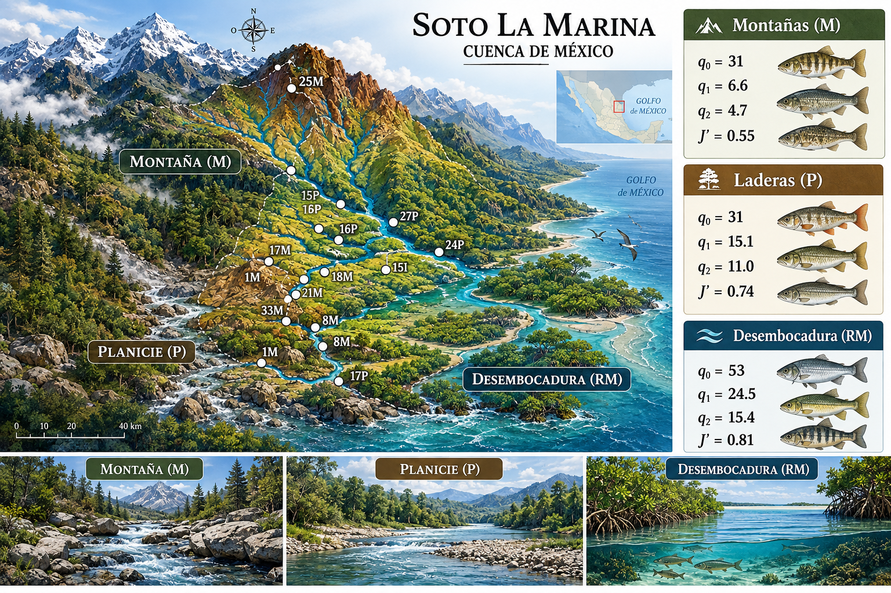
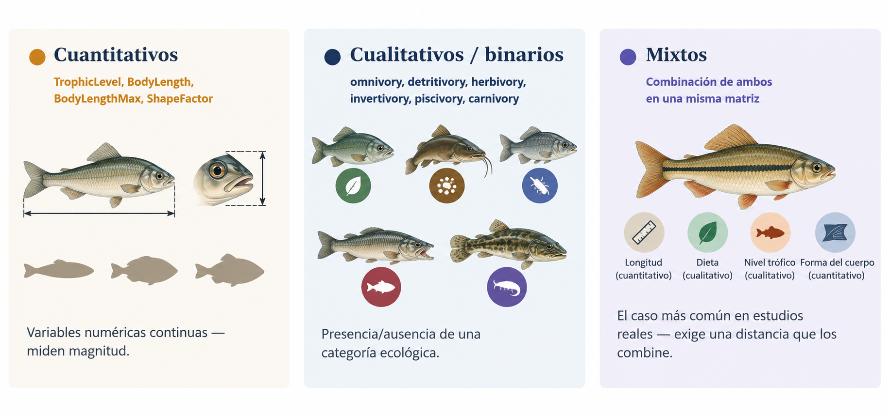
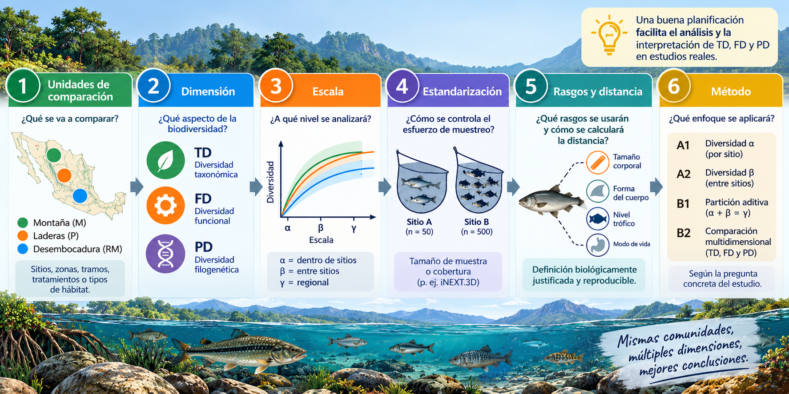

# Taller1. Organización de matrices {.unnumbered}

```{r, echo=FALSE, message=FALSE, warning=FALSE}
#| out-width: "1.1\\linewidth"
#| fig-align: center
#| fig-pos: 'H'

```

Los datos de este y el resto de talleres con peces, son tomados del manuscrito de **Ruiz-Campos et al. (2021)** [(enlace_manuscrito](https://link-springer-com.biblioteca.unimagdalena.edu.co/article/10.1007/s10641-021-01158-9)).


------------

## Materiales requeridos para el taller en clase {.titulo-seccion}

En los siguientes enlaces se podrán descargar archivos comprimidos de los dos talleres donde se pueden aplicar procedimientos para la manipulación y organización de las bases de datos requeridas en los análisis de diversidad funcional - FD y filogenética - PD, con los datos de peces de México de **Ruiz-Campos et al. (2021)** (📰 Taller1_bases_datos_diversidad).

- 📰 [Taller1_bases_datos_diversidad](https://)       # Pendiente de ajuste

**Nota:** una vez se descarguen los materiales, se requiere descomprimirlos antes de realizar cualquier procedimiento y seguir las orientaciones del docente para realizar los ejercicios requeridos. 

### Diapositivas en vivo - Slides.com

{width="150"}

- 📰 [Diapositivas del Taller1_bases_datos_diversidad](https://)  # Pendiente de ajuste


------------

\newpage

## Antes de empezar

- **Semana 2** — cierre de la Unidad I (Introducción y bases conceptuales).
- **Resultados de aprendizaje que se trabajan hoy:** RA1 (calcular e interpretar métricas de diversidad a partir de datos reales) y RA2 (diseñar flujos de trabajo reproducibles en R).
- Este taller usa el **caso guiado de peces de México** del Capítulo 8 del manuscrito Anvidea como **modelo metodológico**. La estructura y el código son exactamente los que se reutilizarán más adelante con la comunidad del Caribe colombiano que se elija para el estudio de caso integrador (Unidad V).

::: callout-note
## Objetivo de esta sesión

Al terminar este taller se podrá:

1.  Cargar y organizar en R las bases de datos que necesita cualquier análisis de diversidad multidimensional: abundancias, rasgos funcionales, coordenadas y una primera aproximación a la filogenia.
2.  Detectar y corregir los errores de alineación más comunes entre esas bases — nombres que no coinciden, espacios ocultos, especies faltantes — **antes** de que produzcan resultados silenciosamente incorrectos.
3.  Dejar el documento Quarto renderizando sin errores: el primer entregable reproducible del curso.
:::

------------------------------------------------------------------------

## 1. Anatomía de un documento reproducible en Quarto

Un archivo `.qmd` tiene tres partes:

1.  **Encabezado YAML** (arriba de todo, entre `---`): título, formato de salida, tabla de contenido, etc. Es lo que se observa al inicio de este mismo archivo.
2.  **Texto narrativo** en Markdown: se explica qué se hizo y por qué, no solo el código.
3.  **Bloques de código** (*chunks*), delimitados por ```` ```{r} ```` y ```` ``` ````: aquí vive el análisis.

Para producir el documento final (HTML, en este caso) se usa el botón **Render** de RStudio, o desde la consola:

```{r}
#| eval: false
quarto::quarto_render("Taller1_bases_datos_diversidad.qmd")
```

::: callout-tip
## Buen hábito desde el primer taller

Se recomienda renderizar el documento **con frecuencia**, no solo al final. Si algo se rompe, es mucho más fácil encontrar el chunk responsable cuando acaba de escribirse.
:::

::: callout-warning
## Si Quarto falla al renderizar con "Acceso denegado"

Si aparece un error como `PermissionDenied: Acceso denegado (os error 5)` señalando una carpeta `..._files\libs`, no es un error en el código ni en los datos — casi siempre es un archivo o proceso de un render anterior que Windows todavía tiene bloqueado.

**Antes de asumir que algo se rompió:**

1.  Reinicia la sesión de R (**Session → Restart R** en RStudio) y vuelve a renderizar.
2.  Si persiste, cierra RStudio por completo y ábrelo de nuevo.
3.  Si aun así falla, borra manualmente la carpeta `..._files` que haya quedado del intento anterior antes de volver a intentarlo.

Casi siempre el primer paso ya lo resuelve.
:::

------------------------------------------------------------------------

## 2. Librerías necesarias

```{r}
#| label: setup
#| message: false
#| warning: false

library(tidyverse)   # manipulación de datos y programación (incluye dplyr, tidyr, ggplot2)
library(readxl)      # leer archivos Excel (.xlsx)
library(kableExtra)  # tablas con mejor formato para el reporte
library(ape)         # manipulación de árboles filogenéticos
library(taxize)      # validación de nombres científicos en bases de datos taxonómicas (NCBI)
```

Si falta alguna, se instala una sola vez con `install.packages("nombre_paquete")` (o `remotes::install_github(...)` para los paquetes que vienen de GitHub, como se verá en semanas posteriores con `iNEXT.3D`).

------------------------------------------------------------------------

## 3. Las bases de datos que se van a necesitar

::: callout-important
## El insumo de todo el curso

Para calcular **cualquier** métrica de TD, FD o PD se necesita, como mínimo, que estas piezas coincidan exactamente en su lista de especies:

| Pieza | Qué contiene | Filas × Columnas |
|------------------------|------------------------|------------------------|
| **Abundancias** | Cuántos individuos de cada especie hay en cada sitio | sitios × especies |
| **Rasgos funcionales** | Características ecológicas de cada especie | especies × rasgos |
| **Filogenia** | Relaciones evolutivas entre especies | árbol / matriz especies × especies |
| **Coordenadas** *(opcional pero útil)* | Ubicación de cada sitio | sitios × (x, y) |

**"Coinciden exactamente" es la parte que más tiempo consume — y la que se va a practicar hoy.**
:::

En este caso guiado, todo proviene del archivo `datos.xlsx`, en las hojas `tax` (abundancias), `rasgos` (rasgos funcionales) y `coord` (coordenadas).

::: callout-warning
## Pequeño detalle si se compara con el capítulo del libro

El texto del Capítulo 8 hace referencia al archivo como `datos.c8.xlsx` (con punto). El archivo real del curso se llama **`datos.xlsx`** (con guion bajo). Si se copia el código del libro tal cual, R indicará que no encuentra el archivo — no es que el código esté mal, es que el nombre cambió.
:::

------------------------------------------------------------------------

## 4. Paso 1 — Matriz de abundancias (`biol1`)

Se carga la hoja `tax`: 42 sitios (filas) y 87 especies de peces (columnas). Las dos primeras columnas (`Sites`, `Sites1`) no son especies — `Sites` es el código del sitio y `Sites1` es la zona del gradiente (`M` = Montaña, `P` = Laderas, `RM` = Desembocadura).

```{r}
#| label: cargar-abundancias

ruta_datos <- "datos.xlsx"   # se ajusta la ruta si el archivo está en otra carpeta

tax <- read_xlsx(ruta_datos, sheet = "tax")

# Matriz de abundancias: sitios (filas) x especies (columnas)
biol1 <- tax %>%
  dplyr::select(-Sites, -Sites1) %>%
  as.data.frame()

rownames(biol1) <- tax$Sites

dim(biol1)            # debería ser 42 sitios x 87 especies
biol1[1:4, 1:5]        # vistazo rápido
```

Se guarda también la zona de cada sitio — se va a necesitar en talleres posteriores para comparar diversidad entre zonas (M, P, RM):

```{r}
#| label: zonas

zonas <- tax %>%
  dplyr::select(Sites, Zona = Sites1)

table(zonas$Zona)
```

------------------------------------------------------------------------

## 5. Paso 2 — Matriz de rasgos funcionales (`rasgos1`)

```{r, echo=FALSE, message=FALSE, warning=FALSE}
#| out-width: "1.1\\linewidth"
#| fig-align: center
#| fig-pos: 'H'

```

La hoja `rasgos` trae, para cada una de las 87 especies: nombre científico completo (`LatinName`), una abreviatura (`Abrev`), y 10 rasgos — 4 cuantitativos (`TrophicLevel`, `BodyLength`, `BodyLengthMax`, `ShapeFactor`) y 6 binarios de dieta (`omnivory`, `detritivory`, `herbivory`, `invertivory`, `piscivory`, `carnivory`).

::: callout-warning
## Por qué se alinea por `LatinName` y no por `Abrev`

El nombre científico completo (`LatinName`) es idéntico —en el mismo orden— entre la hoja `tax` (como nombres de columna) y la hoja `rasgos`. **Ya se verificó: coincide especie por especie.**

La columna `Abrev` es más cómoda para mostrar tablas, pero en este archivo las abreviaturas de `rasgos` no coinciden con las de la hoja `tax1` (son dos esquemas de abreviación distintos generados por separado). Si se abrevia cada matriz por su cuenta —como hace el capítulo del libro con `abbreviate()`— se corre el riesgo de que dos abreviaturas "casi iguales" no coincidan letra por letra, y R no avisa: simplemente se obtiene `NA` o un desalineamiento silencioso.

**Regla práctica: se debe alinear siempre por el identificador más completo y único disponible (aquí, el nombre científico), y generar abreviaturas *después*, a partir de esa alineación ya verificada — nunca de forma independiente en cada matriz.**
:::

```{r}
#| label: cargar-rasgos

rasgos_raw <- read_xlsx(ruta_datos, sheet = "rasgos")

# Chequeo de alineación ANTES de continuar (debe quedar vacío en ambos casos)
setdiff(colnames(biol1), rasgos_raw$LatinName)
setdiff(rasgos_raw$LatinName, colnames(biol1))
```

```{r}
#| label: organizar-rasgos

rasgos1 <- rasgos_raw %>%
  column_to_rownames("LatinName") %>%
  dplyr::select(TrophicLevel, BodyLength, BodyLengthMax, ShapeFactor,
                omnivory, detritivory, herbivory, invertivory, piscivory, carnivory)

# Se reordena para que coincida EXACTAMENTE con el orden de columnas de biol1
rasgos1 <- rasgos1[colnames(biol1), ]

# Chequeo duro: si esto no es TRUE, algo sigue mal alineado
identical(rownames(rasgos1), colnames(biol1))

dim(rasgos1)           # 87 especies x 10 rasgos
head(rasgos1, 4)
```

Si en algún momento se quieren nombres más cortos para tablas o gráficos, ahora sí es seguro generarlos — porque ya se sabe que `rasgos1` y `biol1` están alineados especie por especie:

```{r}
#| label: abreviaturas-seguras

abrev_segura <- setNames(rasgos_raw$Abrev, rasgos_raw$LatinName)[colnames(biol1)]
head(abrev_segura)
```

------------------------------------------------------------------------

## 6. Paso 3 — Coordenadas de las localidades (`coord`)

Esta es la parte donde se va a encontrar —y resolver— un error real de los datos, del tipo que el capítulo del libro advierte pero no muestra en vivo.

```{r}
#| label: cargar-coord

coord_raw <- read_xlsx(ruta_datos, sheet = "coord")

# Intento directo de alinear coord con los sitios de biol1
setdiff(rownames(biol1), coord_raw$Code)
```

Si ese `setdiff()` no quedó vacío, hay al menos un sitio de `biol1` que "no existe" en `coord` — aunque se sabe que sí existe. Se investiga a continuación:

```{r}
#| label: detective-espacios

# Se buscan códigos parecidos a "12M" en coord
coord_raw$Code[grepl("12", coord_raw$Code)]

# Se compara carácter por carácter con el que sí está en biol1
utf8ToInt("12M")                         # el código "correcto", tal como está en tax
utf8ToInt(coord_raw$Code[grepl("12", coord_raw$Code)])   # el código en coord
```

::: callout-tip
## El diagnóstico

`utf8ToInt()` muestra el código numérico de cada carácter. Si se comparan ambos vectores, se notará un valor **160** donde se esperaría un espacio normal (32) o nada. El 160 es un **espacio de no separación** (`\u00A0`) — invisible en la hoja de Excel, pero distinto para R. Es exactamente el tipo de inconsistencia que el capítulo 8 menciona en su sección de "Problemas comunes": *"Evite tildes, caracteres especiales y espacios dobles"*.
:::

La corrección es sencilla una vez identificado el problema: se elimina cualquier carácter que no sea letra o número.

```{r}
#| label: corregir-codigos

coord_raw <- coord_raw %>%
  mutate(Code = str_remove_all(Code, "[^A-Za-z0-9]"))

# Verificación: ahora sí debería quedar vacío
setdiff(rownames(biol1), coord_raw$Code)
```

Con los códigos ya limpios, se organiza la tabla final de coordenadas:

```{r}
#| label: organizar-coord

coord <- coord_raw %>%
  dplyr::select(Code, Longitude, Latitude) %>%
  column_to_rownames("Code")

coord <- coord[rownames(biol1), ]   # mismo orden que biol1

identical(rownames(coord), rownames(biol1))
head(coord, 4)
```

------------------------------------------------------------------------

## 7. Paso 4 — Preparando la dimensión filogenética (primer acercamiento)

En las Unidades III y IV se calcularán FD y PD con estas matrices ya construidas. Por ahora, el objetivo es más modesto: dejar los nombres científicos **listos y validados** para cuando se llegue a esa etapa.

::: callout-warning
## Este paso necesita conexión a internet

El siguiente bloque consulta la base de datos taxonómica del NCBI para cada especie. Si la sala de cómputo no tiene salida a internet en el momento, puede omitirse — no es indispensable para el resto del taller de hoy, y se retomará con calma en la Unidad IV.
:::

```{r}
#| label: ncbi-consulta
#| eval: false

splist <- unique(rasgos_raw$LatinName)

# Consulta la clasificación taxonómica en NCBI para las 87 especies
spcla <- classification(splist, db = "ncbi")

# Se guarda para no repetir esta consulta cada vez que se renderice el documento
saveRDS(spcla, "clasificacion_ncbi.rds")
```

```{r}
#| label: ncbi-diagnostico
#| eval: false

especies_no_encontradas <- names(spcla)[
  vapply(spcla, function(x) is.null(x) || all(is.na(x)), logical(1))
]

especies_no_encontradas   # muestra cuáles especies quedaron fuera
```

::: callout-note
## Por qué esto importa (y un detalle a cuidar)

Es normal que 2 o 3 especies no se encuentren en NCBI (nombres con `sp.`/`spp.`, sinónimos no actualizados, etc.). El capítulo del libro construye el árbol con `class2tree()` a partir de esta clasificación y luego reasigna `rownames(phylo.d) <- colnames(biol2)` usando **todas** las especies originales — pero si NCBI no reconoció a 3 de las 87, el árbol resultante tiene menos puntas que columnas tiene `biol2`, y esa asignación directa puede fallar o, peor, desalinear en silencio.

**La forma segura:** una vez construido el árbol, se conservan solo las especies que sí están en `tr$phylo$tip.label`, y se filtran `biol1` y `rasgos1` a ese mismo subconjunto — en vez de forzar los nombres originales sobre un árbol más pequeño. Este patrón completo se verá cuando se llegue a la Unidad IV.
:::

------------------------------------------------------------------------

## 8. Paso 5 — Checklist final de consistencia

Antes de dar por buena la organización de datos, se ejecutan estas verificaciones. Son exactamente las que se repetirán con los datos del propio estudio de caso más adelante.

```{r}
#| label: checklist-final

chequeos <- tibble(
  chequeo = c(
    "biol1 y rasgos1 tienen las mismas especies, en el mismo orden",
    "biol1 y coord tienen los mismos sitios, en el mismo orden",
    "rasgos1 no tiene valores NA",
    "biol1 no tiene valores negativos"
  ),
  resultado = c(
    identical(colnames(biol1), rownames(rasgos1)),
    identical(rownames(biol1), rownames(coord)),
    !any(is.na(rasgos1)),
    !any(biol1 < 0)
  )
)

chequeos %>%
  kbl(booktabs = TRUE) %>%
  kable_styling(full_width = FALSE) %>%
  row_spec(0, bold = TRUE)
```

Si las cuatro filas dicen `TRUE`, las matrices están listas para cualquier análisis de diversidad que venga después.

------------------------------------------------------------------------

## 9. Qué sigue

```{r, echo=FALSE, message=FALSE, warning=FALSE}
#| out-width: "1.1\\linewidth"
#| fig-align: center
#| fig-pos: 'H'
knitr::include_graphics("fig_portada/alfa.beta.gamma.png")
```

- **Unidad III (Semanas 8–10):** se usará `rasgos1` para construir una matriz de distancias funcionales (Gower) y calcular FRic, FEve, FDiv, FDis y RaoQ con los paquetes `FD` y `mFD`.
- **Unidad IV (Semanas 11–13):** se retomará la validación NCBI de este taller para construir el árbol filogenético completo y su matriz de distancias, y se usará `alineador.R` — una función ya disponible en el curso — para alinear árboles reales con matrices de abundancia por pares de sitios (diversidad beta filogenética).
- **Unidad V (Semanas 14–17):** todo este flujo —abundancias, rasgos, coordenadas, filogenia, checklist— se repetirá con los datos del **propio estudio de caso** del Caribe colombiano.

------------------------------------------------------------------------

## 10. Ejercicio de práctica dirigida (individual)

Con los objetos `biol1`, `rasgos1` y `coord` ya construidos en este documento, se debe resolver y dejar el código en el `.qmd`:

1.  ¿Cuál es el sitio con mayor número de especies presentes (riqueza observada)? Se debe usar `biol1` — se recuerda que una especie está "presente" en un sitio si su abundancia es mayor que cero.
2.  ¿Cuál es la especie más ampliamente distribuida (presente en más sitios)?
3.  Se debe generar una tabla que muestre, para cada zona (`M`, `P`, `RM`), el número de sitios y la riqueza total de especies registrada en esa zona.
4.  En dos o tres frases: ¿qué diferencia hay entre la riqueza de especies por sitio (pregunta 1) y la riqueza total por zona (pregunta 3)? ¿Por qué no son el mismo número?

Se debe renderizar el documento y llevar el HTML a la próxima sesión para socializar los resultados.

------------------------------------------------------------------------

## 11. Anticipando el estudio de caso (Caribe colombiano)

```{r, echo=FALSE, message=FALSE, warning=FALSE}
#| out-width: "0.95\\linewidth"
#| fig-align: center
#| fig-pos: 'H'

```


Antes de cerrar, se debe pensar en el futuro estudio de caso (Unidad V) y responder brevemente:

- ¿Qué grupo taxonómico resulta de interés (peces, aves, plantas, u otro)?
- ¿Dónde se conseguiría una matriz de **abundancias** por sitio para ese grupo en el Caribe colombiano?
- ¿Qué **rasgos funcionales** tendrían sentido ecológico para ese grupo? (se sugiere pensar en al menos 2 cuantitativos y 2 categóricos/binarios)
- ¿Qué obstáculo del taller de hoy —nombres inconsistentes, especies no encontradas en bases taxonómicas, datos faltantes— se considera más probable de enfrentar con los propios datos, y por qué?

No es necesario resolverlo hoy — es una checklist para empezar a revisar las fuentes de datos con tiempo.
