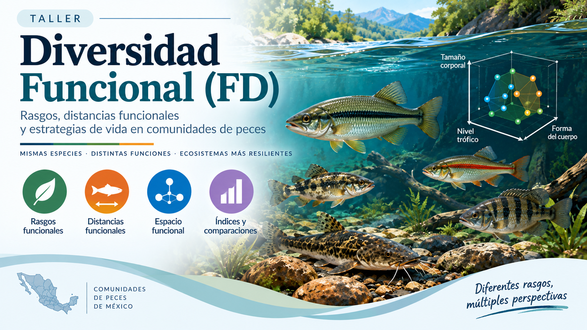
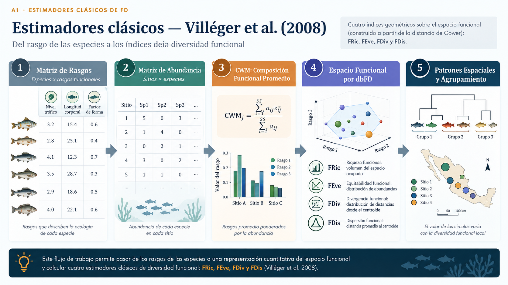
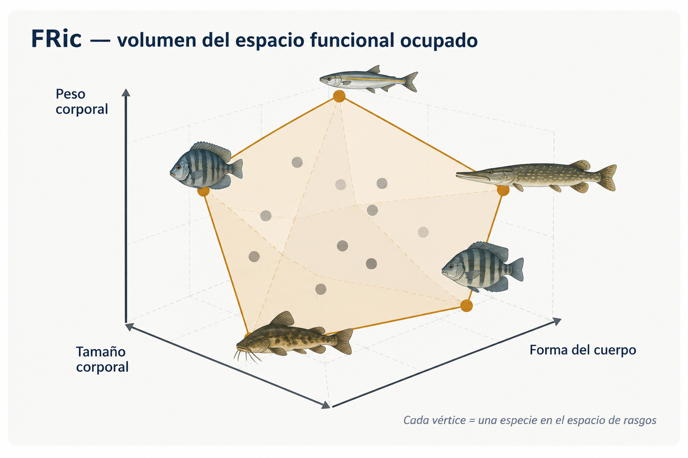
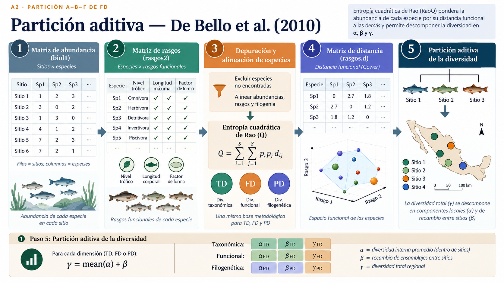
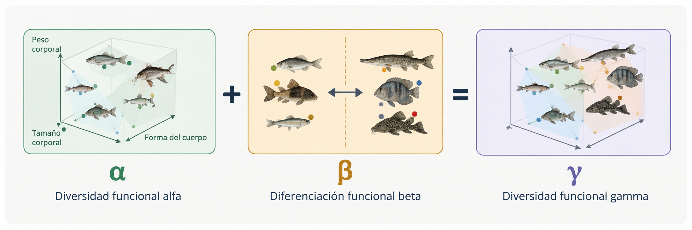
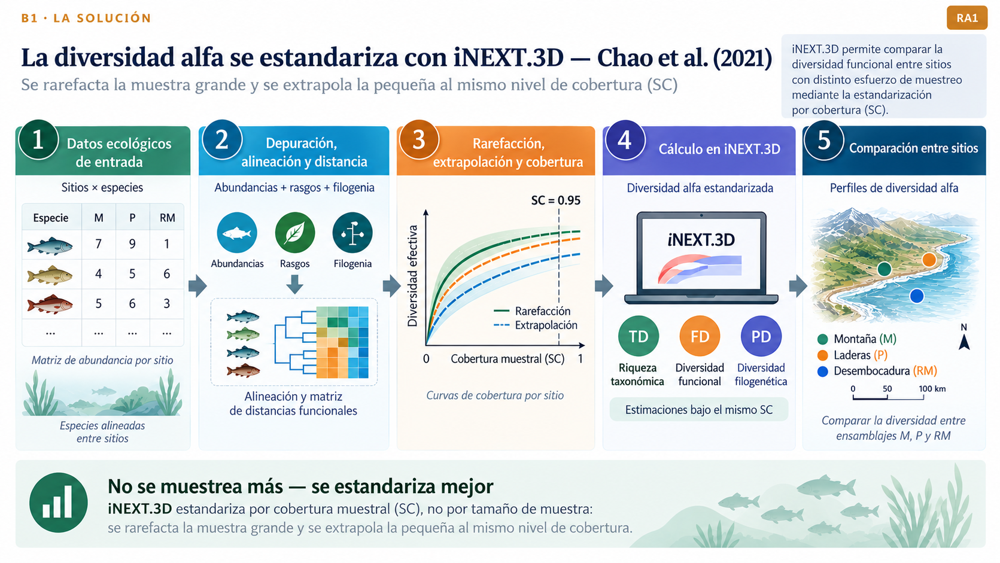
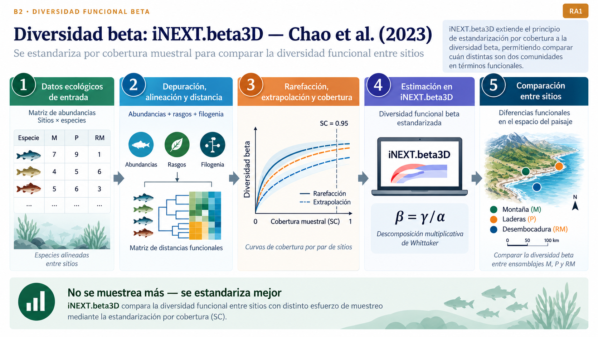
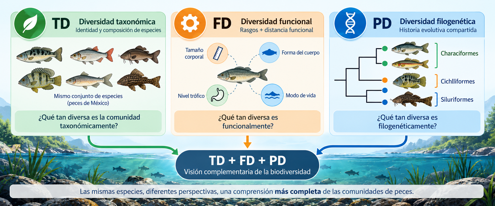

# Taller 2. Diversidad funcional: bloques A1, A2, B1 y B2 {.unnumbered}

```{r, echo=FALSE, message=FALSE, warning=FALSE}
#| out-width: "0.95\\linewidth"
#| fig-align: center
#| fig-pos: 'H'



```

Los datos de este y el resto de talleres con peces, son tomados del manuscrito de **Ruiz-Campos et al. (2021)** [(enlace_manuscrito](https://link-springer-com.biblioteca.unimagdalena.edu.co/article/10.1007/s10641-021-01158-9)).

------------------------------------------------------------------------

## Materiales requeridos para el taller en clase {.titulo-seccion}

En los siguientes enlaces se podrán descargar archivos comprimidos de los dos talleres donde se pueden aplicar procedimientos de diversidad funcional - FD en RStudio, con un caso guiado de peces de México (📰 Taller2_Diversidad_Funcional) y el cuestionario de soporte (📰 Cuestionario_Diversidad_funcional).

- 📰 [Taller2_Diversidad_Funcional](https://) \# Pendiente de ajuste
- 📰 [Cuestionario_Diversidad_funcional](https://) \# Pendiente de ajuste

**Nota:** una vez se descarguen los materiales, se requiere descomprimirlos antes de realizar cualquier procedimiento y seguir las orientaciones del docente para realizar los ejercicios requeridos.

### Diapositivas en vivo - Slides.com

{width="150"}

- 📰 [Diapositivas del Taller2_Diversidad_Funcional](https://) \# Pendiente de ajuste
- 📰 [Diapositivas del Cuestionario_Diversidad_funcional](https://) \# Pendiente de ajuste

------------------------------------------------------------------------

\newpage

# Antes de empezar {.unnumbered}

- **Unidad III (Diversidad Funcional)**. El taller integra cuatro enfoques metodológicos: **A1, A2, B1 y B2**.
- **RA1:** Calcular e interpretar métricas de diversidad funcional con R.
- **RA2:** Diseñar flujos de trabajo reproducibles en R.
- **Requisito:** Haber terminado el Taller 1 y disponer de `biol1`, `rasgos1` y `zonas`.
- **Parte 1 del taler:** Construcción de la distancia funcional y desarrollo del bloque A1 [@villeger2008new], que incluye el complemento CWM [@lavorel2008assessing], realizar el bloque A2 [@rao1982diversity] e inicio del bloque de B1 [@chao2021measuring].
- **Parte 2 del taler:** Desarrollo de B2 [@chao2023rarefaction], comparación de enfoques e integración de resultados.

## Mapa conceptual del taller

::: callout-note
La **multidimensionalidad** responde a *qué dimensión de la biodiversidad se estudia*: diversidad taxonómica (TD), funcional (FD) o filogenética (PD).

La **multiescalaridad** responde a *a qué escala se descompone la diversidad*: alfa (α), beta (β) y gamma (γ).

Los bloques **A1 + A2 + B1 + B2** representan enfoques metodológicos complementarios para estudiar estas dimensiones y escalas:

1.  **A1 — Estimadores clásicos de FD:** FRic, FEve, FDiv, FDis y RaoQ con `dbFD()`.
2.  **A2 — Entropía cuadrática de Rao:** partición de FD en α, β y γ, con componentes aditivos y multiplicativos.
3.  **B1 — Números efectivos de Hill para FD alfa:** `iNEXT3D()`, rarefacción/extrapolación y estandarización por cobertura.
4.  **B2 — Números efectivos de Hill para FD beta:** `iNEXTbeta3D()`, comparación entre comunidades bajo cobertura común.
:::

::: callout-important
## Criterio de uso de los resultados

Los enfoques A1 y A2 describen la estructura funcional con los datos observados, ideales para cuando se cuenta con múltiples localidades, por la facilidad de poder se mapeador. Los enfoques B1 y B2 incorporan la lógica de rarefacción/extrapolación y cobertura muestral para hacer comparaciones más defendibles cuando el esfuerzo de muestreo difiere entre unidades. Ideales para cuando se realizan comparaciones por grupos (ej. zonas, periodos, ...) o pocas muestras (las figuras se saturan como muchas muestras).
:::

------------------------------------------------------------------------

# Punto de partida: datos y matrices {.unnumbered}

Se reconstruye el objeto de trabajo a partir del archivo `datos.xlsx`. La transformación de abundancias convierte los valores vacíos o espacios en blanco en cero para evitar que una celda no numérica se propague como `NA` durante los cálculos.

```{r}
#| label: setup
#| message: false
#| warning: false

library(tidyverse)      # Ecosistema tidyverse (dplyr, tidyr, ggplot2, purrr, ...)
library(readxl)         # Habilita la lectura de archivos .xlsx
library(kableExtra)     # Habilita el formato enriquecido de tablas
library(FD)             # Aporta gowdis() y dbFD()
library(iNEXT.3D)       # Aporta iNEXT3D() y estimate3D(): FD alfa
library(iNEXT.beta3D)   # Aporta iNEXTbeta3D(): FD beta por números de Hill

ruta_datos <- "datos.xlsx"   # Define la ruta relativa del archivo de datos
```

```{r}
#| label: reconstruir-datos
#| message: false
#| warning: false

tax <- read_xlsx(ruta_datos, sheet = "tax")   # Lee la hoja de abundancias por sitio

biol1 <- tax %>%
  dplyr::select(-Sites, -Sites1) %>%          # Retira las columnas de identificación (no son especies)
  mutate(
    across(
      everything(),
      ~ as.numeric(trimws(as.character(.)))   # Fuerza cada columna a numérica, quitando espacios ocultos
    )
  ) %>%
  mutate(
    across(everything(), ~ 
             replace(.x, is.na(.x), 0))       # Reemplaza por 0 cualquier celda que no se pudo convertir
  ) %>%
  as.data.frame()                             # Convierte a data.frame clásico (formato que exige FD/Rao)

rownames(biol1) <- tax$Sites                  # Asigna el código de sitio como nombre de fila

zonas <- tax %>%
  dplyr::select(Sites, Zona = Sites1)         # Conserva el sitio y su zona de gradiente (M/P/RM)

rasgos_raw <- read_xlsx(ruta_datos, sheet = "rasgos")   # Lee la hoja de rasgos funcionales

rasgos1 <- rasgos_raw %>%
  column_to_rownames("LatinName") %>%         # Usa el nombre científico como identificador de fila
  dplyr::select(
    TrophicLevel, BodyLength, BodyLengthMax, ShapeFactor,    # Rasgos cuantitativos
    omnivory, detritivory, herbivory, invertivory,           # Rasgos binarios de dieta (parte 1)
    piscivory, carnivory                                     # Rasgos binarios de dieta (parte 2)
  )

rasgos1 <- rasgos1[colnames(biol1), ]         # Reordena las especies para que coincidan con biol1

stopifnot(identical(colnames(biol1), rownames(rasgos1)))   # Verifica la alineación especie a especie

dim(biol1)          # Confirma las dimensiones (42 sitios x 87 especies)
table(zonas$Zona)   # Confirma el número de sitios por zona
```

```{r}
#| label: reconstruir-coord
#| message: false
#| warning: false

# coord no se usa en A2/B1/B2, pero sí en los mapas espaciales de A1
# (mismo procedimiento del Taller 1: se corrige el espacio de no separación
# oculto en los códigos de sitio antes de alinear con biol1)
coord_raw <- read_xlsx(ruta_datos, sheet = "coord") %>%
  mutate(Code = str_remove_all(Code, "[^A-Za-z0-9]"))   # Elimina caracteres ocultos del código de sitio

coord <- coord_raw %>%
  dplyr::select(Code, Longitude, Latitude) %>%   # Conserva solo el código y las coordenadas
  column_to_rownames("Code")                     # Usa el código de sitio como nombre de fila

coord <- coord[rownames(biol1), ]                # Reordena para que coincida con el orden de biol1

stopifnot(identical(rownames(coord), rownames(biol1)))   # Verifica la alineación sitio a sitio
```

::: callout-tip
## Por qué el esfuerzo de muestreo importa

En este conjunto de datos, `M` reúne 24 sitios y 13.166 individuos, `P` 16 sitios y 5.151 individuos, mientras que `RM` reúne solo 2 sitios y 414 individuos. A pesar de ello, `RM` presenta 53 especies frente a 30 en `M` y 30 en `P`.

Esta asimetría permite utilizar el mismo conjunto de datos para mostrar una diferencia fundamental: **calcular diversidad funcional con los datos observados no equivale a comparar comunidades con igual completitud muestral**.
:::

------------------------------------------------------------------------

# De rasgos a distancia funcional: Gower {.unnumbered}

```{r, echo=FALSE, message=FALSE, warning=FALSE}
#| out-width: "0.95\\linewidth"
#| fig-align: center
#| fig-pos: 'H'
knitr::include_graphics("fig_portada/rasgos.png")
```

Antes de A1, A2, B1 y B2 se construye el mismo insumo funcional: una matriz de distancias especie × especie.

Las seis variables binarias de dieta se consideran **asimétricas**, porque compartir la ausencia de un hábito alimenticio no debe contribuir como una similitud funcional positiva.

```{r}
#| label: gower

vars_bin <- c(
  "omnivory", "detritivory", "herbivory",     # Define los rasgos binarios de dieta...
  "invertivory", "piscivory", "carnivory"     # ...que se van a tratar como asimétricos
)

asym_idx <- match(vars_bin, colnames(rasgos1))   # Ubica la posición de esos rasgos dentro de rasgos1

rasgos.d <- gowdis(
  rasgos1,                # Matriz de rasgos (especies x rasgos)
  asym.bin = asym_idx     # Las columnas binarias se tratan como asimétricas
)

round(as.matrix(rasgos.d)[1:4, 1:4],3)   # Fragmento 4x4 de la matriz de distancias
```

::: callout-note
## Qué representa esta matriz

Cada elemento de `rasgos.d` representa la distancia funcional entre un par de especies. Una distancia pequeña indica mayor semejanza funcional según los rasgos seleccionados; una distancia grande indica mayor diferenciación.

La matriz de distancia es el puente común entre los cuatro enfoques que siguen [@laliberte2010distance].
:::

::: callout-warning
## Antes de interpretar A1, A2, B1 o B2 con estos rasgos: una limitación real de los datos

Tres de los diez rasgos que alimentan `rasgos.d` — `BodyLength`, `BodyLengthMax` y `ShapeFactor` — no son mediciones propias para la mayoría de las especies de este archivo. Un chequeo rápido lo muestra:

```{r}
#| label: chequeo-calidad-rasgos

rasgos_raw %>%
  count(BodyLength, sort = TRUE) %>%   # Cuenta cuántas especies comparten cada valor de BodyLength
  slice(1)                             # Conserva solo el valor más repetido
```

Un único valor se repite en 73 de las 87 especies (84 %) — la repetición exacta entre especies de géneros distintos descarta que sea una coincidencia biológica; es un valor de relleno, aunque no podemos afirmar con certeza qué método se usó para generarlo. El mismo patrón aparece en `BodyLengthMax` y `ShapeFactor`. Esto significa que, para el 84 % de las especies del caso guiado, 3 de los 10 rasgos que definen `rasgos.d` no aportan información real — la distancia de Gower entre esas especies descansa, en la práctica, casi por completo sobre `TrophicLevel` y los seis rasgos binarios de dieta.

**¿Por qué seguir con estos datos de todas formas?** Porque es exactamente la situación se va a encontrar con bases de rasgos reales del Caribe colombiano — datos incompletos.

No se corrige aquí porque hacerlo alteraría el caso guiado del Capítulo 8 frente al cual se compara este taller, y porque no se ha corrido ninguna prueba de sensibilidad que permita afirmar cuánto cambiarían los valores absolutos de FRic/FDis/RaoQ si se retiraran o corrigieran estos tres rasgos: eso es precisamente un buen ejercicio de auditoría que puedes correr tú mismo: repetir el cálculo de `rasgos.d` y de A1 excluyendo `BodyLength`, `BodyLengthMax` y `ShapeFactor` de `rasgos1`, y comparar los índices resultantes contra los de esta versión. **Cuando construyas tu propia matriz de rasgos, corre este mismo chequeo (`count()` sobre cada rasgo cuantitativo) antes de calcular cualquier distancia.** Este hallazgo, junto con la validación de gremios tróficos del Taller 2b, se está registrando como observación para la revisión editorial del manuscrito Anvidea: el Capítulo 8 no advierte en ningún punto que estas tres columnas están mayoritariamente imputadas.
:::

## Dendrograma funcional de las especies

Antes de resumir la FD en índices numéricos, conviene *ver* el espacio funcional que se está construyendo. El siguiente dendrograma agrupa las 87 especies según `rasgos.d` — la misma matriz que alimenta A1, A2, B1 y B2.

```{r}
#| label: fig-dendrograma
#| fig-cap: "Dendrograma funcional de especies (Ward.D2) a partir de la distancia de Gower, con nombres abreviados."
#| message: false
#| warning: false
#| fig-width: 9
#| fig-height: 4.5

library(factoextra)     # Aporta fviz_dend(): graficado del dendrograma
library(RColorBrewer)   # Aporta las paletas de color usadas en el dendrograma

hc_fd <- hclust(rasgos.d, method = "ward.D2")   # Agrupa las especies por distancia funcional (Ward.D2)

# Los 87 nombres científicos completos se solapan en el eje x; se abrevian
# con el mismo criterio que usa el manuscrito para biol1 (minlength = 4)
hc_fd$labels <- abbreviate(hc_fd$labels, minlength = 4)   # Acorta cada nombre a ~4 caracteres

k_grupos <- 3   # Define el número de grupos de referencia a colorear

fig1 <-
fviz_dend(
  hc_fd,                                                # Objeto de agrupamiento jerárquico (con etiquetas ya abreviadas)
  k = k_grupos,                                         # Número de grupos a resaltar con color
  cex = 0.5,                                            # Tamaño del texto de las etiquetas
  lwd = 0.6,                                            # Grosor de las líneas del dendrograma
  k_colors = brewer.pal(max(k_grupos, 3), "Dark2"),     # Paleta de color para los grupos
  rect = FALSE,                                         # Omite los rectángulos alrededor de los grupos
  main = "Dendrograma funcional de especies",           # Título del gráfico
  ylab = "Distancia funcional (Ward.D2)",               # Etiqueta del eje y
  xlab = ""                                             # Sin etiqueta en el eje x (nombres de especie)
) +
  theme_classic(base_size = 12) +                       # Aplica un tema limpio, sin fondo gris
  theme(
    axis.text.x = element_text(size = 7, angle = 90, vjust = 0.5, hjust = 1),   # Rota las etiquetas de especie
    plot.title = element_text(face = "bold", hjust = 0.5)                       # Centra y resalta el título
  )

print(fig1)
```

::: callout-tip
## Cómo leer este dendrograma

Las uniones más bajas (cerca de 0) son especies casi idénticas en sus rasgos; las uniones altas separan estrategias funcionales muy distintas. Los tres colores son un agrupamiento de referencia (Ward.D2, *k* = 3) — no corresponden a las zonas `M`/`P`/`RM`, sino a *estrategias funcionales* que después se van a encontrar mezcladas o concentradas en cada zona.
:::

## Agrupamiento no jerárquico (k-medias en el espacio PCoA)

Con 87 especies, un dendrograma lineal sigue siendo apretado incluso con nombres abreviados. El Capítulo 8 resuelve esto con una alternativa no jerárquica: proyectar las especies en un plano PCoA (dos ejes, en vez de 87 posiciones en una línea) y agruparlas con *k*-medias. El PCoA que se calcula aquí (`pcoa_fd`) es el mismo que reaparece más adelante en A1, para el espacio funcional por zona — se calcula una sola vez.

```{r}
#| label: fig-kmeans-pcoa
#| fig-cap: "Agrupamiento no jerárquico (k-medias, k = 3) de las especies en el espacio funcional reducido por PCoA."
#| message: false
#| warning: false
#| fig-width: 8
#| fig-height: 6.5

library(ape)       # Aporta pcoa(): análisis de coordenadas principales
library(ggrepel)   # Evita la superposición de etiquetas de texto

# PCoA sobre la distancia de Gower — se reutiliza en A1 (espacio funcional por zona)
pcoa_fd <- ape::pcoa(as.matrix(rasgos.d), correction = "cailliez")   # Calcula el PCoA con corrección de euclidianidad
var1 <- round(100 * pcoa_fd$values$Rel_corr_eig[1], 1)   # Calcula el % de varianza explicado por el eje 1
var2 <- round(100 * pcoa_fd$values$Rel_corr_eig[2], 1)   # Calcula el % de varianza explicado por el eje 2

ejes <- as.data.frame(pcoa_fd$vectors[, 1:2])   # Extrae las coordenadas de los dos primeros ejes
colnames(ejes) <- c("PCoA1", "PCoA2")           # Nombra las columnas de coordenadas
ejes$Especie <- rownames(ejes)                  # Recupera el nombre de especie como columna
ejes$Abrev <- abbreviate(ejes$Especie, minlength = 4)   # Genera la misma abreviatura usada en el dendrograma

set.seed(2026)   # Fija la semilla para que el agrupamiento k-medias sea reproducible
km_fd <- kmeans(scale(ejes[, c("PCoA1", "PCoA2")]), centers = k_grupos, nstart = 50)   # Agrupa en 3 clústeres
ejes$cluster <- factor(km_fd$cluster)   # Guarda la asignación de clúster de cada especie


fig2 <-
ggplot(ejes, aes(PCoA1, PCoA2, color = cluster, label = Abrev)) +
  stat_ellipse(type = "norm", level = 0.68, linewidth = 0.7, alpha = 0.12, show.legend = FALSE) +   # Dibuja la elipse de cada clúster
  geom_point(size = 2.1) +                                        # Dibuja cada especie como un punto
  ggrepel::geom_text_repel(size = 3, max.overlaps = 100, show.legend = FALSE) +   # Añade la etiqueta abreviada sin solaparse
  scale_color_brewer(palette = "Dark2") +
  labs(
    title = "Agrupamiento k-medias en el espacio funcional (PCoA)",
    x = paste0("PCoA1 (", var1, "%)"),
    y = paste0("PCoA2 (", var2, "%)"),
    color = "Clúster"
  ) +
  theme_classic(base_size = 13) +
  theme(
    legend.position = "bottom",
    plot.title = element_text(face = "bold", hjust = 0.5)
  )

print(fig2)
```

::: callout-tip
## Por qué esta figura complementa al dendrograma

El dendrograma (Ward.D2) y el agrupamiento k-medias parten de la misma matriz de distancias, pero no tienen por qué asignar exactamente las mismas especies a cada grupo — son dos algoritmos distintos (jerárquico aglomerativo vs. particional) sobre el mismo espacio funcional. Cuando ambos coinciden en separar los mismos tres grupos, es una señal de que esa estructura funcional es robusta y no un artefacto del método elegido.
:::

------------------------------------------------------------------------

\newpage

# A1. Estimadores clásicos de diversidad funcional

```{r, echo=FALSE, message=FALSE, warning=FALSE}
#| out-width: "0.95\\linewidth"
#| fig-align: center
#| fig-pos: 'H'

```

## Estructura funcional con `dbFD()`

```{r, echo=FALSE, message=FALSE, warning=FALSE}
#| out-width: "0.95\\linewidth"
#| fig-align: center
#| fig-pos: 'H'

```

El enfoque A1 describe la **estructura funcional de cada unidad de muestreo** mediante índices clásicos. Se utiliza la matriz de distancia de Gower ya construida para mantener el mismo espacio funcional durante todo el taller.

`dbFD()` implementa, entre otros, los índices —FRic, FEve y FDiv— además de FDis y RaoQ [@villeger2008new].

### Ejecutar `dbFD()`

```{r}
#| label: dbfd-a1
#| message: false
#| warning: false

fd_a1 <- dbFD(
  x = rasgos.d,          # Matriz de distancias funcionales (especie x especie)
  a = biol1,             # Matriz de abundancias (sitios x especies)
  w.abun = TRUE,         # Pondera los índices por abundancia relativa
  stand.FRic = TRUE,     # Estandariza FRic por el número de especies (mismo criterio del Capítulo 8)
  calc.FRic = TRUE,      # Calcula la riqueza funcional (FRic)
  calc.FDiv = TRUE,      # Calcula la divergencia funcional (FDiv)
  calc.CWM = FALSE,      # El CWM no puede derivarse de una matriz de distancias — se calcula aparte, en "Community Weighted Means" más abajo
  corr = "cailliez",     # Corrección de Cailliez para garantizar euclidianidad (misma que usa el Capítulo 8)
  messages = FALSE       # Suprime los mensajes de progreso de la función
)
```

::: callout-note
## Por qué `corr = "cailliez"` y no `"sqrt"`

Ambas correcciones son válidas para volver euclidiana una distancia de Gower, pero **no producen la misma escala numérica** en FDis y RaoQ — cambian cuánto se "estiran" las distancias para satisfacer la desigualdad triangular. Aquí se usa `"cailliez"` porque es la que aplica el Capítulo 8 del manuscrito; si comparas tus propios resultados contra el libro, usar la misma corrección es indispensable para que los números (y el tamaño de los círculos en los mapas) sean comparables.
:::

::: callout-note
## Por qué `calc.CWM = FALSE` aquí

`gowdis()` devuelve una matriz de **distancias** entre especies, no la tabla de rasgos originales. El CWM se define como $\sum_i p_i \cdot rasgo_i$ — necesita el valor crudo de cada rasgo por especie, información que una matriz de distancias ya no contiene (solo quedan las distancias par a par). Pedirle a `dbFD()` que calcule CWM a partir de `x = rasgos.d` no tiene de dónde sacar esos valores. Por eso aquí se desactiva (`calc.CWM = FALSE`) y se calcula aparte, en la sección "Community Weighted Means" más abajo, directamente desde la tabla de rasgos originales — exactamente como lo hace el Capítulo 8.
:::

### Extraer los índices

```{r}
#| label: tabla-a1

fd_a1_sitios <- tibble(
  Sitio = rownames(biol1),               # Extrae el código de cada sitio
  FRic  = as.numeric(fd_a1$FRic),        # Extrae la riqueza funcional por sitio
  FEve  = as.numeric(fd_a1$FEve),        # Extrae la equidad funcional por sitio
  FDiv  = as.numeric(fd_a1$FDiv),        # Extrae la divergencia funcional por sitio
  FDis  = as.numeric(fd_a1$FDis),        # Extrae la dispersión funcional por sitio
  RaoQ  = as.numeric(fd_a1$RaoQ)         # Extrae la entropía cuadrática de Rao por sitio
) %>%
  left_join(zonas, by = c("Sitio" = "Sites"))   # Añade la zona correspondiente a cada sitio

fd_a1_sitios %>%
  head(10) %>%                                   # Conserva solo los primeros 10 sitios para la vista previa
  kbl(
    booktabs = TRUE, digits = 3, align = "c",
    caption = "Índices clásicos de diversidad funcional — primeros 10 sitios"
  ) %>%
  kable_styling(
    bootstrap_options = c("striped", "hover", "condensed"),   # Aplica franjas, resalte al pasar el mouse y filas compactas
    full_width = FALSE,
    position = "center"
  ) %>%
  row_spec(0, bold = TRUE, color = "white", background = "#2E4057")   # Resalta el encabezado
```

### Resumir A1 por zona

```{r}
#| label: resumen-a1

fd_a1_zona <- fd_a1_sitios %>%
  group_by(Zona) %>%                             # Agrupa los sitios por zona
  summarise(
    n = n(),                                     # Cuenta el número de sitios por zona
    across(
      c(FRic, FEve, FDiv, FDis, RaoQ),
      ~ mean(.x, na.rm = TRUE)                   # Promedia cada índice, ignorando los NA
    ),
    .groups = "drop"                             # Retira la agrupación del resultado final
  )

fd_a1_zona %>%
  kbl(
    booktabs = TRUE, digits = 3, align = "c",
    caption = "Promedio de los índices clásicos de FD por zona"
  ) %>%
  kable_styling(
    bootstrap_options = c("striped", "hover", "condensed"),
    full_width = FALSE, position = "center"
  ) %>%
  row_spec(0, bold = TRUE, color = "white", background = "#2E4057") %>%
  column_spec(1, bold = TRUE)   # Resalta la columna de zona
```

::: callout-warning
## Valores `NA` en algunos índices

Algunos sitios pueden presentar `NA` para FRic, FEve o FDiv. Esto no debe interpretarse automáticamente como un valor de diversidad igual a cero ni reemplazarse por cero. Estos índices requieren una representación funcional que puede no ser estimable para determinadas composiciones locales de especies. Además, el resumen por zona es descriptivo y debe interpretarse con cautela porque el número de sitios es desigual, especialmente en `RM`.
:::

```{r}
#| label: fig-a1
#| fig-cap: "Índices clásicos de diversidad funcional por zona. Los puntos representan sitios y las distribuciones resumen la variación entre sitios."
#| fig-height: 6

fd_a1_sitios %>%
  pivot_longer(
    cols = c(FRic, FEve, FDiv, FDis, RaoQ),   # Selecciona los cinco índices a graficar
    names_to = "Indice",                      # Crea una columna con el nombre del índice
    values_to = "Valor"                       # Crea una columna con el valor correspondiente
  ) %>%
  ggplot(aes(x = Zona, y = Valor)) +
  geom_boxplot(outlier.shape = NA) +           # Dibuja la distribución por zona, sin marcar outliers aparte
  geom_jitter(width = 0.08, alpha = 0.6) +     # Superpone cada sitio como un punto disperso
  facet_wrap(~ Indice, scales = "free_y") +    # Separa un panel por índice, con escala propia
  labs(
    x = "Zona",
    y = "Valor",
    title = "Estructura funcional a escala de sitio"
  )
```

::: callout-important
## Cómo interpretar A1

- **FRic** describe el espacio funcional ocupado por la comunidad.
- **FEve** describe cómo se distribuye la abundancia dentro del espacio funcional.
- **FDiv** describe la posición relativa de las abundancias respecto al centro del espacio funcional.
- **FDis** mide la dispersión funcional respecto al centroide de la comunidad.
- **RaoQ** incorpora simultáneamente abundancia relativa y distancia funcional entre especies.

Estos índices no son intercambiables: una comunidad puede presentar valores altos de un índice y bajos de otro porque responden a propiedades diferentes de la estructura funcional. La documentación de `dbFD()` también reporta `qual.FRic`, que permite evaluar la calidad de la representación reducida utilizada para FRic/FDiv.
:::

### Revisar la calidad del espacio funcional

```{r}
#| label: calidad-fric

fd_a1$qual.FRic   # Extrae la calidad de representación del espacio reducido usado por FRic/FDiv
```

::: callout-warning
## Qué significa este número

`qual.FRic` va de 0 a 1 y mide cuánta de la distancia funcional original (`rasgos.d`) sobrevive en el espacio reducido que usan FRic y FDiv. Un valor de \~0.45, como el de este conjunto de datos, es **moderado-bajo**: FRic y FDiv siguen siendo útiles para comparar sitios entre sí, pero no deben citarse como una medida absoluta y precisa del volumen funcional — se recomienda reportarlos siempre junto con este valor de calidad.
:::

### Mapa espacial de los índices funcionales por sitio

Esta es la figura con la que el Capítulo 8 presenta A1 — cada círculo es un sitio, y su tamaño es proporcional al índice funcional de ese panel. Se reutiliza aquí con `coord`, el objeto que ya se construyó en el Taller 1.

::: callout-warning
## Por qué esta versión no copia los multiplicadores del libro

El Capítulo 8 usa `cex = res$RaoQ / 2`, `cex = res$FDis * 1.5`, etc. — multiplicadores fijos que funcionan **solo** para la magnitud de índices que resultó de *su* corrida de `dbFD()`. Copiar esos mismos números aquí sin verificarlos fue, de hecho, el error que produjo círculos invisibles en FRic y RaoQ en una versión anterior de este taller: la magnitud de `fd_a1$RaoQ` no tiene por qué coincidir con la de `res$RaoQ` del libro, incluso usando la misma función. La solución reproducible es **reescalar cada índice a un rango de tamaños visible, sin importar su magnitud original** — así el código funciona igual de bien con `datos.xlsx` que con cualquier comunidad del Caribe colombiano.
:::

```{r}
#| label: fig-mapa-a1
#| fig-cap: "Distribución espacial de los índices clásicos de diversidad funcional por sitio (FRic, FEve, FDiv, FDis, RaoQ)."
#| fig-width: 8
#| fig-height: 10.5
#| message: false
#| warning: false

# Reescala cualquier índice a un rango de tamaños de círculo fijo (0.4 a 3.2),
# sin importar la magnitud original del índice — reemplaza a los multiplicadores fijos
escalar_cex <- function(x, min_cex = 0.4, max_cex = 3.2) {
  rango <- range(x, na.rm = TRUE)                       # Calcula el mínimo y máximo del índice (ignora NA)
  if (diff(rango) == 0) return(rep(mean(c(min_cex, max_cex)), length(x)))   # Evita dividir por cero si el índice es constante
  min_cex + (x - rango[1]) / diff(rango) * (max_cex - min_cex)              # Reescala linealmente al rango de tamaños deseado
}

par(
  mfrow = c(3, 2),                              # Organiza los paneles en una cuadrícula de 3 filas x 2 columnas
  mar = c(4.5, 4.5, 3, 1),                       # Define los márgenes de cada panel
  cex.axis = 0.8, cex.lab = 1.1, cex.main = 1    # Ajusta el tamaño de texto de ejes y título
)

plot(coord, asp = 1, pch = 21, col = "white", bg = "brown",   # Dibuja un círculo por sitio
     cex = escalar_cex(fd_a1$FRic),                            # Escala el tamaño del círculo según FRic (reescalado)
     main = "(a) Riqueza funcional (FRic)",
     xlab = "Longitud", ylab = "Latitud")
lines(coord, col = "light blue")   # Conecta los sitios en su orden de fila (referencia visual del recorrido)

plot(coord, asp = 1, pch = 21, col = "white", bg = "brown",
     cex = escalar_cex(fd_a1$FEve),                            # Escala el tamaño del círculo según FEve (reescalado)
     main = "(b) Equidad funcional (FEve)",
     xlab = "Longitud", ylab = "Latitud")
lines(coord, col = "light blue")

plot(coord, asp = 1, pch = 21, col = "white", bg = "brown",
     cex = escalar_cex(fd_a1$FDiv),                            # Escala el tamaño del círculo según FDiv (reescalado)
     main = "(c) Divergencia funcional (FDiv)",
     xlab = "Longitud", ylab = "Latitud")
lines(coord, col = "light blue")

plot(coord, asp = 1, pch = 21, col = "white", bg = "brown",
     cex = escalar_cex(fd_a1$FDis),                            # Escala el tamaño del círculo según FDis (reescalado)
     main = "(d) Dispersión funcional (FDis)",
     xlab = "Longitud", ylab = "Latitud")
lines(coord, col = "light blue")

plot(coord, asp = 1, pch = 21, col = "white", bg = "brown",
     cex = escalar_cex(fd_a1$RaoQ),                            # Escala el tamaño del círculo según RaoQ (reescalado)
     main = "(e) Entropía cuadrática de Rao (RaoQ)",
     xlab = "Longitud", ylab = "Latitud")
lines(coord, col = "light blue")

plot.new()   # Deja el sexto panel vacío (FGR no se calculó en esta corrida de dbFD())
```

::: callout-tip
## Nota de transferencia

`escalar_cex()` funciona con cualquier índice y cualquier conjunto de datos porque el reescalado depende del rango real de los valores, no de un número copiado de otro documento. Al transferir este código a datos propios, no hace falta tocar nada de esta función — solo revisar que `min_cex`/`max_cex` produzcan círculos legibles en el tamaño de figura elegido.
:::

### Espacio funcional por zona (nuevo — no está en el manuscrito)

Los índices de A1 son números que *resumen* un espacio funcional multidimensional. Antes de seguir a A2, vale la pena **ver ese espacio directamente**: cada especie es un punto en el mismo plano PCoA calculado antes (`pcoa_fd`, sección "Agrupamiento no jerárquico"), y la envolvente convexa (*convex hull*) de una zona sobre estos dos primeros ejes es una representación visual simplificada del espacio funcional que ocupa esa zona — no el cálculo multidimensional exacto que usa `dbFD()` internamente para FRic (ver advertencia más abajo).

```{r}
#| label: prep-espacio-funcional
#| message: false
#| warning: false

# Presencia de cada especie por zona, a partir de biol1 + zonas
# (reutiliza pcoa_fd/ejes calculados en "Agrupamiento no jerárquico"; no se vuelve a correr pcoa())
presencia_zona <- biol1 %>%
  rownames_to_column("Sites") %>%               # Recupera el código de sitio como columna
  left_join(zonas, by = "Sites") %>%             # Añade la zona correspondiente a cada sitio
  dplyr::select(-Sites) %>%                      # Retira el código de sitio (ya no se necesita)
  group_by(Zona) %>%                             # Agrupa por zona
  summarise(across(everything(), sum), .groups = "drop") %>%   # Suma las abundancias dentro de cada zona
  pivot_longer(-Zona, names_to = "Especie", values_to = "Abundancia") %>%   # Pasa a formato largo
  filter(Abundancia > 0) %>%                     # Conserva solo las especies presentes en cada zona
  left_join(ejes, by = "Especie")                # Añade las coordenadas PCoA (ya calculadas) de cada especie

# Envolvente convexa por zona (se requiere un mínimo de 3 especies para formar un polígono)
hulls_zona <- presencia_zona %>%
  group_by(Zona) %>%                             # Agrupa por zona
  filter(n() >= 3) %>%                           # Excluye zonas con menos de 3 especies (no forman polígono)
  slice(chull(PCoA1, PCoA2))                     # Conserva solo los puntos del borde convexo
```

::: callout-warning
## Qué NO es este polígono

Este polígono se calcula sobre **solo los dos primeros ejes de la PCoA** (PCoA1–PCoA2), elegidos porque son los que se pueden dibujar en un plano. `dbFD()`, en cambio, calcula FRic usando tantos ejes como retenga internamente el espacio corregido (aquí no se fijó el argumento `m`, así que puede usar más de dos). Por eso el área de este polígono es una **ilustración del concepto** — útil para razonar sobre el patrón entre zonas — pero no un recálculo exacto ni un reemplazo del valor numérico de FRic que ya se reportó en A1. Si el orden visual de los polígonos no coincidiera exactamente con el orden numérico de FRic, la explicación más probable es esta diferencia de dimensionalidad, no un error de cálculo.
:::

### Espacio total vs. ocupado, por zona (estilo Tette-Pomárico et al., 2026)

Tette-Pomárico et al. (2026) [@tette2026beyond] — un estudio de zooplancton marino-costero en Santa Marta, con la misma lógica de Gower + espacio reducido + envolvente convexa — separan esta pregunta en un panel por grupo, mostrando de fondo el **espacio funcional total** (todas las especies del estudio) y, encima, el espacio **realmente ocupado** por ese grupo en particular, con el tamaño de cada punto proporcional a su abundancia. Esa variante se reproduce aquí (sin las ilustraciones originales del artículo, que tienen ilustrador acreditado) usando las tres zonas en vez de disturbio × estación.

```{r}
#| label: fig-espacio-total-vs-zona
#| fig-cap: "Espacio funcional total (gris, de fondo; PCoA1–PCoA2) frente al espacio ocupado por cada zona (color), con el tamaño de cada especie proporcional a su abundancia. Envolventes calculadas sobre los dos primeros ejes de la PCoA — ver advertencia sobre FRic arriba. Estilo adaptado de Tette-Pomárico et al. (2026)."
#| message: false
#| warning: false
#| fig-width: 9
#| fig-height: 4

# Envolvente convexa del espacio funcional TOTAL (las 87 especies, sin distinguir zona)
hull_total <- ejes %>%
  slice(chull(PCoA1, PCoA2)) %>%      # Conserva solo los puntos del borde convexo de todo el pool de especies
  dplyr::select(PCoA1, PCoA2)         # Conserva solo las coordenadas (se repite para cada panel)

# Repite el polígono total una vez por zona, para que aparezca de fondo en cada panel del facet_wrap
hull_total_rep <- purrr::map_dfr(
  unique(presencia_zona$Zona),
  ~ hull_total %>% mutate(Zona = .x)   # Añade la etiqueta de zona a cada copia del polígono total
)

ggplot() +
  geom_polygon(
    data = hull_total_rep, aes(PCoA1, PCoA2),
    fill = "grey88", color = "grey55", linewidth = 0.4    # Dibuja el espacio funcional total, igual en los tres paneles
  ) +
  geom_polygon(
    data = hulls_zona, aes(PCoA1, PCoA2, fill = Zona, color = Zona),
    alpha = 0.35, linewidth = 0.7, show.legend = FALSE     # Dibuja el espacio realmente ocupado por esa zona
  ) +
  geom_point(
    data = presencia_zona, aes(PCoA1, PCoA2, size = Abundancia, color = Zona),
    alpha = 0.75, show.legend = c(size = TRUE, colour = FALSE)   # Dibuja cada especie; el tamaño refleja su abundancia
  ) +
  facet_wrap(~ Zona) +                                     # Un panel por zona, con el mismo fondo gris en los tres
  scale_size_continuous(range = c(1, 9), name = "Abundancia") +
  scale_color_brewer(palette = "Set2") +
  scale_fill_brewer(palette = "Set2") +
  labs(
    title = "Espacio funcional total vs. ocupado, por zona",
    x = paste0("PCoA1 (", var1, "%)"),
    y = paste0("PCoA2 (", var2, "%)")
  ) +
  theme_bw(base_size = 12) +
  theme(
    legend.position = "bottom",
    plot.title = element_text(face = "bold", hjust = 0.5),
    strip.background = element_rect(fill = "grey25"),
    strip.text = element_text(color = "white", face = "bold")
  )
```

::: callout-important
## Cómo leer estos paneles

El gris de fondo (idéntico en los tres paneles) es el techo — el espacio funcional máximo que existe en todo el conjunto de datos, sobre estos dos ejes. Comparar cuánto de ese gris queda cubierto de color en cada panel responde directamente "¿qué fracción del espacio funcional disponible ocupa esta zona?". El tamaño de los puntos (abundancia) añade una tercera pieza de información: una zona puede ocupar poco espacio pero con especies muy abundantes, o mucho espacio con especies raras — dos historias ecológicas distintas que un polígono sin burbujas no distingue.

Un espacio más grande equivale a más FRic, no porque haya "más" especies necesariamente, sino porque esas especies están más **dispersas** en el espacio de rasgos. Si el espacio de `RM` se ve grande a pesar de tener solo 2 sitios, este panel muestra *visualmente* la misma advertencia que se va a confirmar numéricamente en B1 y B2: `RM` puede parecer funcionalmente muy diverso simplemente porque sus pocas muestras capturaron especies muy distintas entre sí — no necesariamente porque la zona *sea* así.

**Lectura del patrón encontrado.** El espacio de `M` es casi degenerado y queda anidado dentro del de `P`, mientras que `RM` ocupa una región del techo gris que ninguna de las otras dos zonas alcanza. Bajo el marco de hipótesis gráficas de Boersma et al. (2016) [@boersma2016linking], este patrón no corresponde a un simple "efecto igual" (`Equal impact`, que solo movería la abundancia total): la diferencia de forma y tamaño entre los tres paneles es más compatible con una combinación de **recambio funcional** (*functional turnover* — el centroide de `RM` se ubica en una zona del espacio que `M` no ocupa) y **divergencia funcional** (*convergence/divergence* — el rango de espacio ocupado difiere claramente entre zonas). Mouillot et al. (2013) [@mouillot2013functional] describen exactamente este tipo de comparación —el solapamiento parcial de superficies convexas frente a un techo común— como la forma más directa de visualizar erosión o expansión de la riqueza funcional entre ensamblajes: aquí, el bajo solapamiento entre `M` y `RM` sugiere que la desembocadura no es solo un subconjunto más rico de las especies de `M`, sino que aporta estrategias funcionales que las zonas más muestreadas no capturan — una hipótesis que **debe leerse junto con la advertencia de esfuerzo de muestreo** de la sección 4 (B1/B2), no de forma aislada. Recuerda también la advertencia anterior: esta lectura es sobre el espacio proyectado en dos ejes, no sobre el FRic multidimensional exacto que reporta `dbFD()`.
:::

### Community Weighted Means (CWM): ¿qué rasgo domina cada zona?

Los índices anteriores describen *cuánta* diversidad funcional hay en cada sitio. El CWM responde una pregunta distinta: dado un rasgo, **¿cuál es su valor promedio en la comunidad, ponderado por la abundancia de cada especie?** No es una medida de diversidad — es una medida de composición funcional dominante [@lavorel2008assessing].

$$\text{CWM}_{rasgo} = \sum_{i=1}^{S} p_i \cdot rasgo_i$$

donde $p_i$ es la abundancia relativa de la especie $i$ en el sitio.

Como se vio arriba, `dbFD()` no puede calcularlo aquí porque recibió `rasgos.d` (una matriz de distancias) en lugar de la tabla de rasgos originales. El CWM se calcula entonces aparte, con `FD::functcomp()` — la misma función que usa el Capítulo 8 para este propósito —, directamente sobre `rasgos1` (rasgos crudos por especie) y `biol1` (abundancias por sitio).

```{r}
#| label: calcular-cwm

cwm_sitio <- functcomp(
  x = rasgos1,             # Tabla de rasgos originales por especie (NO la matriz de distancias rasgos.d)
  a = as.matrix(biol1),    # Matriz de abundancias (sitios x especies)
  CWM.type = "all"         # Incluye el promedio de los rasgos cuantitativos y la proporción de cada clase binaria
)

colnames(cwm_sitio)   # Antes de seleccionar columnas: revisa cómo se llamaron realmente
```

::: callout-warning
## Por qué `piscivory` ya no es el nombre de la columna

Con `CWM.type = "all"`, `functcomp()` no promedia los rasgos binarios de dieta como si fueran números continuos: los trata como una variable de dos clases (0/1) y devuelve la abundancia relativa de **cada clase** por separado. Por eso `piscivory` se convierte en dos columnas, `piscivory_0` y `piscivory_1` (y lo mismo para `herbivory` y el resto de rasgos binarios) — `colnames(cwm_sitio)` lo muestra arriba. Esto no es un error: es exactamente el comportamiento que documenta el Capítulo 8 para `functcomp()` (de ahí columnas como `omnivory_1` en su propia tabla de resultados). La columna `..._1` es la que interesa aquí: la proporción de la abundancia del sitio que corresponde a especies con ese hábito alimenticio. Si en cambio se quisiera un único valor por rasgo binario (tratándolo como 0/1 numérico puro), habría que agregar `bin.num = TRUE` a la llamada — pero eso ya no sería exactamente lo que hace el Capítulo 8, así que aquí se mantiene el comportamiento por defecto.
:::

```{r}
#| label: tabla-cwm-zona

cwm_zona <- cwm_sitio %>%
  as_tibble() %>%
  mutate(Sitio = rownames(cwm_sitio)) %>%          # Recupera el código de sitio (functcomp() lo trae como nombre de fila)
  left_join(zonas, by = c("Sitio" = "Sites")) %>%  # Añade la zona correspondiente a cada sitio
  group_by(Zona) %>%
  summarise(
    across(where(is.numeric), ~ mean(.x, na.rm = TRUE)),   # Promedia cada CWM de sitio dentro de la zona
    .groups = "drop"
  )

cwm_zona %>%
  dplyr::select(
    Zona, TrophicLevel, BodyLength,
    piscivory = piscivory_1,     # Proporción de abundancia con hábito piscívoro
    herbivory = herbivory_1      # Proporción de abundancia con hábito herbívoro
  ) %>%
  kbl(
    booktabs = TRUE, digits = 2, align = "c",
    caption = "Community Weighted Mean (CWM) de algunos rasgos, por zona"
  ) %>%
  kable_styling(
    bootstrap_options = c("striped", "hover", "condensed"),
    full_width = FALSE, position = "center"
  ) %>%
  row_spec(0, bold = TRUE, color = "white", background = "#2E4057") %>%
  column_spec(1, bold = TRUE)
```

```{r}
#| label: fig-cwm-trofico
#| fig-cap: "CWM de nivel trófico por zona: qué estrategia trófica domina, en promedio, cada gradiente."
#| fig-height: 3.2
#| message: false
#| warning: false

ggplot(cwm_zona, aes(x = Zona, y = TrophicLevel, fill = Zona)) +
  geom_col(width = 0.55, show.legend = FALSE) +          # Una barra por zona, sin leyenda redundante
  scale_fill_brewer(palette = "Set2") +
  labs(
    title = "CWM de nivel trófico por zona",
    x = "Zona", y = "Nivel trófico promedio (ponderado por abundancia)"
  ) +
  theme_classic(base_size = 13) +
  theme(plot.title = element_text(face = "bold", hjust = 0.5))
```

::: callout-important
## Cómo leer el CWM — y por qué no es lo mismo que A1

Un CWM de nivel trófico más alto en `RM` que en `M` no dice que `RM` sea *más diversa* — puede tener la misma FRic o incluso menor. Dice que, en promedio, las especies dominantes de `RM` ocupan un nivel trófico más alto. **A1 (FRic, FEve, FDiv, FDis, RaoQ) describe la estructura del espacio funcional; el CWM describe qué región de ese espacio concentra la abundancia.** Ambas lecturas son complementarias: dos zonas pueden tener FRic idéntico y CWM opuesto, o viceversa.

En tu estudio de caso, el CWM es la herramienta más directa para responder preguntas del tipo "¿qué estrategia domina en cada tramo de mi gradiente, y cambia con la profundidad, la cobertura vegetal o la distancia a la desembocadura?" — sin necesitar todavía ninguna partición alfa-beta-gamma.
:::

::: callout-tip
## Para discutir en clase (10-15 min)

**CWM-1.** Según `cwm_zona` y la figura anterior, ¿qué zona presenta el CWM de nivel trófico más alto? ¿Qué estrategia trófica caracteriza, en promedio, a esa zona?

**CWM-2.** Compara esta tabla con el resumen de FRic por zona (sección A1, más arriba): ¿hay alguna zona con FRic relativamente bajo que aun así tenga un CWM claramente distinto a las demás? ¿Qué te dice eso sobre la diferencia entre "cuánta" diversidad funcional hay y "qué" domina en la comunidad?

Las preguntas CWM-3 y CWM-4 (más exigentes, incluyen cálculo adicional) se resuelven fuera de clase — ver **Ejercicio 2 — CWM** en la sección de práctica dirigida.
:::

::: callout-note
## Pregunta ecológica de A1

La pregunta central es: **¿cómo se organiza la diversidad funcional dentro de cada comunidad, y qué rasgo domina esa organización?**

A1 (con CWM) todavía no responde cuánto de la diversidad funcional regional corresponde a diferencias entre zonas. Esa pregunta se aborda en A2.
:::

------------------------------------------------------------------------

\newpage

# A2. Entropía cuadrática de Rao y partición α–β–γ

```{r, echo=FALSE, message=FALSE, warning=FALSE}
#| out-width: "0.95\\linewidth"
#| fig-align: center
#| fig-pos: 'H'

```

## Partición multiescalar con `Rao()`

```{r, echo=FALSE, message=FALSE, warning=FALSE}
#| out-width: "0.8\\linewidth"
#| fig-align: center
#| fig-pos: 'H'

```

A2 cambia la pregunta: en lugar de describir cada sitio mediante varios índices, se busca **descomponer la diversidad funcional en componentes alfa, beta y gamma** mediante la entropía cuadrática de Rao [@rao1982diversity].

Se muestran las dos formas clásicas de partición:

$$\gamma = \overline{\alpha} + \beta_{add}$$

y

$$\gamma = \overline{\alpha} \times \beta_{mult}.$$

### De sitios a zonas

Para este ejercicio, la unidad de comparación es la zona. Se suman las abundancias de los sitios pertenecientes a cada zona.

```{r}
#| label: biol-zona

biol_zona <- biol1 %>%
  rownames_to_column("Sites") %>%          # Recupera el código de sitio como columna
  left_join(zonas, by = "Sites") %>%       # Añade la zona correspondiente a cada sitio
  dplyr::select(-Sites) %>%                # Retira el código de sitio (ya no se necesita)
  group_by(Zona) %>%                       # Agrupa por zona
  summarise(across(everything(), sum), .groups = "drop") %>%   # Suma las abundancias dentro de cada zona
  column_to_rownames("Zona") %>%           # Usa la zona como nombre de fila
  t() %>%                                  # Transpone: las especies pasan a filas y las zonas a columnas
  as.data.frame()                          # Convierte a data.frame (formato que exige Rao())

# Especies (filas) × zonas (columnas)
dim(biol_zona)     # Confirma las dimensiones (87 especies x 3 zonas)
biol_zona[1:5, ]   # Muestra las primeras 5 especies
```

```{r}
#| label: chequeos-rao

sum(is.na(biol_zona))              # Cuenta los valores NA (debe dar 0)
sum(biol_zona < 0, na.rm = TRUE)   # Cuenta los valores negativos (debe dar 0)
```

### Ejecutar `Rao()`

```{r}
#| label: rao-particion
#| message: false
#| warning: false

source("Rao.R")   # Carga la función Rao(), con las definiciones internas de Qdecomp() y disc()

fd_zonas <- Rao(
  sample = biol_zona,   # Matriz de abundancias (especies x zonas)
  dfunc  = rasgos.d,    # Matriz de distancias funcionales (Gower)
  dphyl  = NULL,        # Sin distancia filogenética (se incorpora en la Unidad IV)
  weight = FALSE,       # Usa la definición original de Rao (sin ponderar por abundancia total)
  Jost   = FALSE        # No aplica la corrección de Jost (números efectivos)
)
```

### Leer α, β y γ

En lugar de dejar las salidas de `Rao()` como objetos aislados, se organizan los componentes principales en tablas para facilitar su lectura ecológica.

```{r}
#| label: rao-resultados

rao_alpha <- tibble(
  Zona = names(fd_zonas$FD$Alpha),           # Extrae el nombre de cada zona
  Alfa_FD = as.numeric(fd_zonas$FD$Alpha)    # Extrae la diversidad funcional alfa de cada zona
)

rao_particion <- tibble(
  Componente = c(
    "Alfa media",
    "Gamma",
    "Beta aditiva",
    "Beta multiplicativa"
  ),
  Valor = c(
    as.numeric(fd_zonas$FD$Mean_Alpha),                       # Alfa media entre las tres zonas
    as.numeric(fd_zonas$FD$Gamma),                             # Diversidad funcional regional (gamma)
    as.numeric(fd_zonas$FD$Beta_add),                          # Beta aditiva (gamma menos alfa media)
    as.numeric(fd_zonas$FD$Gamma / fd_zonas$FD$Mean_Alpha)     # Beta multiplicativa (gamma sobre alfa media)
  )
)

rao_alpha %>%
  kbl(
    booktabs = TRUE, digits = 3, align = "c",
    caption = "Diversidad funcional alfa por zona"
  ) %>%
  kable_styling(
    bootstrap_options = c("striped", "hover", "condensed"),
    full_width = FALSE, position = "center"
  ) %>%
  row_spec(0, bold = TRUE, color = "white", background = "#2E4057") %>%
  column_spec(1, bold = TRUE)   # Resalta la columna de zona

rao_particion %>%
  kbl(
    booktabs = TRUE, digits = 3, align = "c",
    caption = "Partición regional de la diversidad funcional"
  ) %>%
  kable_styling(
    bootstrap_options = c("striped", "hover", "condensed"),
    full_width = FALSE, position = "center"
  ) %>%
  row_spec(0, bold = TRUE, color = "white", background = "#2E4057") %>%
  row_spec(3:4, bold = TRUE, background = "#FDF3E7")   # Resalta las dos filas de beta (aditiva y multiplicativa)
```

La **beta aditiva** se expresa mediante `γ = α + βadd`, mientras que la **beta multiplicativa** se obtiene mediante `γ / α`. El objeto `Beta_prop` de `Rao()` se conserva como medida proporcional para las comparaciones entre pares.

```{r}
#| label: rao-pares

beta_add_mat <- as.matrix(fd_zonas$FD$Pairwise_samples$Beta_add)     # Convierte la beta aditiva pareada a matriz
beta_prop_mat <- as.matrix(fd_zonas$FD$Pairwise_samples$Beta_prop)   # Convierte la beta proporcional pareada a matriz

pair_index <- tibble(
  Comparacion = c("M_vs_P", "M_vs_RM", "P_vs_RM"),   # Define el nombre de cada comparación
  Zona_1 = c("M", "M", "P"),                          # Define la primera zona de cada par
  Zona_2 = c("P", "RM", "RM")                         # Define la segunda zona de cada par
)

rao_beta_pares <- pair_index %>%
  mutate(
    Beta_add = map2_dbl(
      Zona_1, Zona_2,
      ~ beta_add_mat[.y, .x]      # Extrae la beta aditiva correspondiente a cada par
    ),
    Beta_prop = map2_dbl(
      Zona_1, Zona_2,
      ~ beta_prop_mat[.y, .x]     # Extrae la beta proporcional correspondiente a cada par
    )
  ) %>%
  select(Comparacion, Beta_add, Beta_prop)   # Conserva solo las columnas relevantes para la tabla

rao_beta_pares %>%
  kbl(
    booktabs = TRUE, digits = 3, align = "c",
    caption = "Beta funcional entre pares de zonas (Rao, sin estandarizar)"
  ) %>%
  kable_styling(
    bootstrap_options = c("striped", "hover", "condensed"),
    full_width = FALSE, position = "center"
  ) %>%
  row_spec(0, bold = TRUE, color = "white", background = "#2E4057") %>%
  row_spec(which.max(rao_beta_pares$Beta_prop), bold = TRUE, background = "#FDECEC")   # Resalta el par más divergente
```

::: callout-note
## Qué añade A2 respecto a A1

A1 entrega una descripción de la estructura funcional de cada sitio. A2 permite preguntar **cuánto cambia la diversidad funcional entre unidades** y cómo se relacionan α, β y γ.

La partición de Rao utilizada aquí no corrige el desbalance de esfuerzo entre `M`, `P` y `RM`. Por ello, sus resultados observados son fundamentales para compararlos posteriormente con B1 y B2.
:::

### Comparación rápida entre TD y FD

`Rao()` puede calcular simultáneamente la diversidad taxonómica asociada a una distancia de identidad y la diversidad funcional cuando se proporciona `dfunc`.

```{r}
#| label: comparar-td-fd

tabla_td_fd <- tibble(
  Zona    = names(fd_zonas$FD$Alpha),         # Extrae el nombre de cada zona
  Alfa_TD = as.numeric(fd_zonas$TD$Alpha),    # Extrae la diversidad taxonómica alfa
  Alfa_FD = as.numeric(fd_zonas$FD$Alpha)     # Extrae la diversidad funcional alfa
)

tabla_td_fd %>%
  kbl(
    booktabs = TRUE, digits = 3, align = "c",
    caption = "Comparación entre diversidad taxonómica (TD) y funcional (FD) por zona"
  ) %>%
  kable_styling(
    bootstrap_options = c("striped", "hover", "condensed"),
    full_width = FALSE, position = "center"
  ) %>%
  row_spec(0, bold = TRUE, color = "white", background = "#2E4057") %>%
  column_spec(1, bold = TRUE)
```

::: callout-tip
## Pregunta de interpretación

Si la zona con mayor diversidad taxonómica no coincide con la de mayor diversidad funcional, se debe discutir qué puede estar indicando esa diferencia sobre la **redundancia funcional** y la composición de rasgos.
:::

### Mapa espacial de la diversidad alfa por sitio (TD y FD)

La comparación anterior es por zona (3 valores). El Capítulo 8 complementa esto con un mapa a nivel de **sitio** (42 valores) — aquí se reproduce con dos paneles en vez de tres, porque la dimensión filogenética (PD) todavía no se ha calculado (llega en la Unidad IV). Para esto se necesita `Rao()` a escala de sitio, no de zona: se usa `t(biol1)` en lugar de `biol_zona`.

```{r}
#| label: fig-mapa-a2
#| fig-cap: "Distribución espacial de la diversidad alfa taxonómica (TD) y funcional (FD) por sitio."
#| fig-width: 8
#| fig-height: 5.5
#| message: false
#| warning: false

fd_sitios_rao <- Rao(
  sample = t(biol1),   # Especies (filas) x sitios (columnas) — escala de sitio, no de zona
  dfunc  = rasgos.d,    # Matriz de distancias funcionales (Gower)
  dphyl  = NULL,        # Sin distancia filogenética (se incorpora en la Unidad IV)
  weight = FALSE,       # Usa la definición original de Rao
  Jost   = FALSE        # No aplica la corrección de Jost
)

par(
  mfrow = c(1, 2),                               # Un panel para TD y otro para FD, uno al lado del otro
  mar = c(4.5, 4.5, 3, 1),
  cex.axis = 0.8, cex.lab = 1.1, cex.main = 1
)

plot(coord, asp = 1, pch = 21, col = "white", bg = "brown",
     cex = escalar_cex(fd_sitios_rao$TD$Alpha),    # Reutiliza la misma función de escala automática de A1
     main = "Diversidad taxonómica (TD)",
     xlab = "Longitud", ylab = "Latitud")
lines(coord, col = "light blue")

plot(coord, asp = 1, pch = 21, col = "white", bg = "brown",
     cex = escalar_cex(fd_sitios_rao$FD$Alpha),
     main = "Diversidad funcional (FD)",
     xlab = "Longitud", ylab = "Latitud")
lines(coord, col = "light blue")
```

::: callout-note
## Lectura del mapa

Un sitio con un círculo grande en TD pero pequeño en FD (o viceversa) es exactamente el tipo de discrepancia que señala redundancia o divergencia funcional a escala local — la misma pregunta de la tabla anterior, pero ahora visible sitio por sitio en vez de promediada por zona. Cuando se incorpore PD en la Unidad IV, este mismo bloque de código se extiende agregando un tercer panel con `fd_sitios_rao$PD$Alpha`, sin cambiar nada más.
:::

------------------------------------------------------------------------

\newpage

# B1. Números efectivos de Hill para diversidad funcional alfa

```{r, echo=FALSE, message=FALSE, warning=FALSE}
#| out-width: "0.95\\linewidth"
#| fig-align: center
#| fig-pos: 'H'

```

## Diversidad funcional alfa con `iNEXT3D()`

B1 introduce una idea diferente: la diversidad funcional puede expresarse mediante **números efectivos de Hill**, evaluados para diferentes órdenes de diversidad:

- **q = 0:** representa la riqueza funcional efectiva; las entidades contribuyen independientemente de su abundancia.
- **q = 1:** corresponde al número efectivo asociado a la entropía de Shannon; las abundancias reciben un peso proporcional.
- **q = 2:** aumenta el peso relativo de las entidades dominantes.

En `iNEXT3D()`, la diversidad funcional se calcula proporcionando una matriz de distancias entre especies mediante `FDdistM`; con `FDtype = "AUC"` se integra el perfil de umbrales funcionales para obtener una medida global [@chao2021measuring].

### Información básica y cobertura observada

```{r}
#| label: inext3d-info
#| message: false
#| warning: false
#| cache: true

fd_alpha_inext <- iNEXT3D(
  data      = biol_zona,             # Matriz de abundancias (especies x zonas)
  diversity = "FD",                   # Dimensión funcional
  q         = c(0, 1, 2),             # Órdenes de diversidad a estimar
  datatype  = "abundance",            # Tipo de dato: abundancias
  knots     = 20,                     # Número de puntos de la curva de rarefacción/extrapolación
  nboot     = 5,                      # Número de remuestreos bootstrap (bajo, para uso en clase)
  FDdistM   = as.matrix(rasgos.d),    # Matriz de distancias funcionales
  FDtype    = "AUC",                  # Método de área bajo la curva
  FDcut_number = 15                   # Número de umbrales de distancia considerados
)

fd_alpha_inext$FDInfo %>%
  kbl(
    booktabs = TRUE, digits = 3, align = "c",
    caption = "Información muestral por zona: tamaño de muestra, riqueza observada y cobertura"
  ) %>%
  kable_styling(
    bootstrap_options = c("striped", "hover", "condensed"),
    full_width = FALSE, position = "center"
  ) %>%
  row_spec(0, bold = TRUE, color = "white", background = "#2E4057") %>%
  scroll_box(width = "100%")   # Habilita desplazamiento horizontal si la tabla no cabe en pantalla
```

::: callout-note
## Parámetros de demostración

En este taller se utiliza `nboot = 5` y `FDcut_number = 15` para reducir el tiempo de cálculo durante la práctica. Para un análisis final se recomienda evaluar un número mayor de réplicas bootstrap y una discretización más fina del intervalo de `tau` cuando la precisión de la estimación sea relevante.
:::

::: callout-important
## Por qué B1 es distinto de A2

A2 calcula la diversidad funcional observada y la particiona en α–β–γ.

B1 utiliza la lógica de rarefacción/extrapolación de `iNEXT3D()` para estudiar cómo cambia la diversidad funcional alfa al modificar el tamaño de muestra o la cobertura. La función produce resultados basados tanto en tamaño de muestra como en cobertura y permite representar curvas para q = 0, 1 y 2 [@chao2021measuring].
:::

### Curvas de rarefacción/extrapolación por tamaño de muestra

```{r}
#| label: fig-b1-size
#| fig-cap: "Curvas de rarefacción/extrapolación de diversidad funcional alfa según el tamaño de muestra, para q = 0, 1 y 2."
#| fig-height: 5

fig_b1_size <- ggiNEXT3D(
  fd_alpha_inext,             # Resultado de iNEXT3D()
  type = 1,                   # Curvas basadas en tamaño de muestra
  facet.var = "Assemblage",   # Un panel por zona
  color.var = "Order.q"       # Colorea por orden de diversidad q
) +
  labs(
    x = "Tamaño de muestra",
    y = "Diversidad funcional (FD_AUC)",
    color = "Orden q",
    fill = "Orden q"
  )

fig_b1_size   # Muestra el gráfico
```

> **Lectura:** las curvas permiten evaluar cuánto cambia la estimación de FD alfa al aumentar el tamaño de muestra. La parte continua corresponde a rarefacción y la parte extrapolada extiende la estimación más allá del esfuerzo observado.

### Curvas de cobertura

```{r}
#| label: fig-b1-coverage
#| fig-cap: "Curvas de rarefacción/extrapolación de diversidad funcional alfa en función de la cobertura muestral."
#| fig-height: 5

fig_b1_coverage <- ggiNEXT3D(
  fd_alpha_inext,
  type = 3,                 # Curvas basadas en cobertura de la muestra
  facet.var = "Order.q"     # Un panel por orden de diversidad q
) +
  labs(
    x = "Cobertura de la muestra",
    y = "Diversidad funcional (FD_AUC)",
    color = "Zona",
    fill = "Zona"
  )

fig_b1_coverage   # Muestra el gráfico
```

La documentación de `ggiNEXT3D()` define `type = 1` como curvas basadas en tamaño de muestra, `type = 2` como curvas de completitud y `type = 3` como curvas basadas en cobertura [@chao2021measuring].

### Comparar las zonas a una cobertura común

Para una comparación directa de diversidad alfa, se puede seleccionar una cobertura común. `estimate3D()` permite calcular los números efectivos de Hill para q = 0, 1 y 2 en un nivel específico de cobertura; cuando no se especifica `level`, utiliza la cobertura mínima entre las muestras como referencia [@chao2021measuring].

```{r}
#| label: b1-cobertura-comun
#| message: false
#| warning: false

nivel_cobertura <- min(
  as.numeric(fd_alpha_inext$FDInfo$`SC(n)`),   # Extrae la cobertura observada de cada zona
  na.rm = TRUE                                  # Ignora los valores ausentes, si los hubiera
)   # Toma la cobertura más baja como nivel de referencia común

nivel_cobertura   # Muestra el nivel de cobertura seleccionado
```

```{r}
#| label: b1-estimacion-comun

fd_alpha_cobertura <- estimate3D(
  data      = biol_zona,             # Matriz de abundancias (especies x zonas)
  diversity = "FD",                   # Dimensión funcional
  q         = c(0, 1, 2),             # Órdenes de diversidad a estimar
  datatype  = "abundance",            # Tipo de dato: abundancias
  base      = "coverage",             # Estandariza por cobertura muestral
  level     = nivel_cobertura,        # Fija el nivel de cobertura común entre zonas
  nboot     = 5,                      # Número de remuestreos bootstrap
  FDdistM   = as.matrix(rasgos.d),    # Matriz de distancias funcionales
  FDtype    = "AUC",                  # Método de área bajo la curva
  FDcut_number = 15                   # Número de umbrales de distancia considerados
)

fd_alpha_cobertura %>%
  kbl(
    booktabs = TRUE, digits = 3, align = "c",
    caption = "Diversidad funcional alfa estimada a cobertura común"
  ) %>%
  kable_styling(
    bootstrap_options = c("striped", "hover", "condensed"),
    full_width = FALSE, position = "center"
  ) %>%
  row_spec(0, bold = TRUE, color = "white", background = "#2E4057") %>%
  column_spec(1, bold = TRUE) %>%
  scroll_box(width = "100%")   # Habilita desplazamiento horizontal si la tabla no cabe en pantalla
```

::: callout-note
## Lectura de B1

La comparación a cobertura común evita interpretar como diferencia ecológica una diferencia que puede deberse a que una zona fue muestreada con mayor o menor completitud.

El objetivo no es sustituir A1 o A2, sino añadir una capa de **estandarización del proceso de muestreo**.
:::

------------------------------------------------------------------------

\newpage

# B2. Números efectivos de Hill para diversidad funcional beta

```{r, echo=FALSE, message=FALSE, warning=FALSE}
#| out-width: "0.95\\linewidth"
#| fig-align: center
#| fig-pos: 'H'

```

## Diversidad funcional beta con `iNEXTbeta3D()`

B2 extiende la lógica de B1 hacia la diversidad beta. `iNEXTbeta3D()` permite calcular diversidad gamma, alfa y beta estandarizada mediante cobertura común, además de varios índices de disimilitud. Para FD se proporciona la matriz de distancias funcionales mediante `FDdistM` [@chao2023rarefaction].

### Construir los pares de zonas

```{r}
#| label: pares-zonas

zonas_id <- c("M", "P", "RM")   # Define el orden de las zonas a comparar

nombres_pares <- combn(
  zonas_id,
  2,                                         # Genera todas las combinaciones posibles de a pares
  FUN = \(p) paste(p, collapse = "_vs_")     # Construye el nombre de cada comparación
)

biol_FD_beta <- combn(zonas_id, 2, simplify = FALSE) %>%   # Genera la lista de pares de zonas
  set_names(nombres_pares) %>%                              # Asigna el nombre de cada par a la lista
  map(\(p) biol_zona[, p, drop = FALSE])                     # Extrae las dos columnas correspondientes a cada par

names(biol_FD_beta)   # Muestra los nombres de los tres pares generados
```

### Chequeos de consistencia

```{r}
#| label: chequeos-beta

biol.dist.beta <- as.matrix(rasgos.d)   # Convierte la distancia de Gower en matriz cuadrada

stopifnot(is.matrix(biol.dist.beta))                                        # Verifica que sea una matriz
stopifnot(isSymmetric(biol.dist.beta))                                      # Verifica la simetría de las distancias
stopifnot(identical(rownames(biol.dist.beta), colnames(biol.dist.beta)))    # Verifica coherencia de nombres
stopifnot(
  all(
    map_lgl(
      biol_FD_beta,
      \(m) identical(rownames(m), rownames(biol.dist.beta))   # Verifica que cada par comparta el mismo orden de especies
    )
  )
)
```

### Ejecutar `iNEXTbeta3D()`

```{r}
#| label: inextbeta3d-fd
#| cache: true
#| message: false
#| warning: false

fd_beta_cobertura <- iNEXTbeta3D(
  data         = biol_FD_beta,     # Lista de pares de zonas a comparar
  diversity    = "FD",              # Dimensión funcional
  q            = c(0, 1, 2),        # Órdenes de diversidad a estimar
  datatype     = "abundance",       # Tipo de dato: abundancias
  base         = "coverage",        # Estandariza por cobertura muestral
  nboot        = 5,                 # Número de remuestreos bootstrap
  FDdistM      = biol.dist.beta,    # Matriz de distancias funcionales
  FDtype       = "AUC",             # Método de área bajo la curva
  FDcut_number = 15                 # Número de umbrales de distancia considerados
)
```

::: callout-note
## Parámetros de demostración en B2

Al igual que en B1, `nboot = 5` y `FDcut_number = 15` se utilizan aquí para mantener el ejercicio ágil. En un análisis definitivo conviene aumentar ambos valores según la precisión requerida y el tiempo de cómputo disponible.
:::

`iNEXTbeta3D()` permite además especificar niveles particulares de cobertura mediante `level`; por defecto, con `base = "coverage"`, genera estimaciones estandarizadas a lo largo de un rango de coberturas apropiado para las muestras analizadas [@chao2023rarefaction].

### Curvas de gamma, alfa y beta

```{r}
#| label: fig-b2-beta
#| fig-cap: "Curvas de rarefacción/extrapolación por cobertura para la diversidad funcional gamma, alfa y beta en las comparaciones M–P, M–RM y P–RM, para q = 0, 1 y 2."
#| message: false
#| warning: false
#| fig-height: 6

ggiNEXTbeta3D(
  fd_beta_cobertura,   # Resultado de iNEXTbeta3D()
  type = "B"           # Curvas de gamma, alfa y beta bajo estandarización por cobertura
) +
  labs(
    x = "Cobertura de la muestra",
    y = "Diversidad funcional (FD_AUC)",
    color = "Comparación",
    fill = "Comparación",
    shape = "Comparación",
    linetype = "Tipo de curva"
  ) +
  theme(axis.text.x = element_text(angle = 45, hjust = 1))   # Rota las etiquetas del eje x
```

La función `ggiNEXTbeta3D()` utiliza `type = "B"` para representar las curvas de gamma, alfa y beta bajo estandarización por cobertura. También permite `type = "D"` para los cuatro índices de disimilitud [@chao2023rarefaction].

### Extraer las tres comparaciones beta a cobertura común

Para evitar seleccionar visualmente un punto de una curva, se puede solicitar un nivel específico de cobertura. Se toma como referencia una cobertura común conservadora entre los tres pares, de modo que **M–P, M–RM y P–RM puedan compararse bajo el mismo nivel de completitud muestral**.

```{r}
#| label: nivel-beta

coberturas_beta <- map_dfr(
  fd_beta_cobertura,
  ~ .x$beta %>%
    select(Dataset, Order.q, SC)   # Conserva solo la comparación, el orden q y la cobertura
) %>%
  summarise(
    nivel_comun = min(SC, na.rm = TRUE)   # Toma la cobertura mínima entre todas las comparaciones
  )

nivel_beta_comun <- coberturas_beta$nivel_comun   # Guarda el nivel común como un único valor
nivel_beta_comun   # Muestra el nivel de cobertura seleccionado
```

```{r}
#| label: beta-cobertura-comun
#| message: false
#| warning: false

fd_beta_comun <- iNEXTbeta3D(
  data         = biol_FD_beta,
  diversity    = "FD",
  q            = c(0, 1, 2),
  datatype     = "abundance",
  base         = "coverage",
  level        = nivel_beta_comun,   # Fija el nivel de cobertura común calculado antes
  nboot        = 5,
  FDdistM      = biol.dist.beta,
  FDtype       = "AUC",
  FDcut_number = 15
)

fd_beta_comun_tabla <- map_dfr(
  names(fd_beta_comun),
  ~ fd_beta_comun[[.x]]$beta %>%
    mutate(Comparacion = .x, .before = 1) %>%    # Añade el nombre de la comparación como primera columna
    select(Comparacion, Order.q, SC, Size, Beta, Method, s.e., LCL, UCL, Diversity)   # Conserva las columnas clave
)

fd_beta_comun_tabla %>%
  kbl(
    booktabs = TRUE, digits = 3, align = "c",
    caption = "Beta funcional estimada a cobertura común"
  ) %>%
  kable_styling(
    bootstrap_options = c("striped", "hover", "condensed"),
    full_width = FALSE, position = "center",
    font_size = 13
  ) %>%
  row_spec(0, bold = TRUE, color = "white", background = "#2E4057") %>%
  add_header_above(c(" " = 4, "Estimación" = 2, " " = 1, "Intervalo de confianza" = 2, " " = 1)) %>%
  scroll_box(width = "100%")   # Habilita desplazamiento horizontal (la tabla tiene muchas columnas)
```

::: callout-important
## Qué aporta B2

A2 permite calcular beta funcional a partir de la partición de Rao con los datos observados.

B2 permite preguntar **cómo se comporta esa beta funcional cuando las comunidades se comparan a una cobertura muestral común**. Esto resulta especialmente importante cuando el esfuerzo de muestreo es muy diferente entre las unidades comparadas.
:::

------------------------------------------------------------------------

\newpage

# Integración A1 → A2 → B1 → B2

```{r, echo=FALSE, message=FALSE, warning=FALSE}
#| out-width: "0.95\\linewidth"
#| fig-align: center
#| fig-pos: 'H'

```

## Cuatro preguntas, cuatro herramientas

```{r}
#| label: tabla-integracion

tabla_integracion <- tibble(
  Bloque = c("A1", "A2", "B1", "B2"),
  `Pregunta principal` = c(
    "¿Cómo se organiza el espacio funcional dentro de cada comunidad?",
    "¿Cómo se reparte la FD entre α, β y γ?",
    "¿Cuál es la FD alfa en números efectivos y cómo cambia con la cobertura?",
    "¿Cuál es la FD beta cuando las comunidades se comparan con igual cobertura?"
  ),
  Escala = c("Principalmente α", "α–β–γ", "α", "β y γ"),
  Herramienta = c("dbFD()", "Rao()", "iNEXT3D() / estimate3D()", "iNEXTbeta3D()")
)

tabla_integracion %>%
  kbl(
    booktabs = TRUE, align = "c",
    caption = "Los cuatro bloques metodológicos del taller"
  ) %>%
  kable_styling(
    bootstrap_options = c("striped", "hover", "condensed"),
    full_width = TRUE, position = "center"
  ) %>%
  row_spec(0, bold = TRUE, color = "white", background = "#2E4057") %>%
  column_spec(1, bold = TRUE) %>%
  column_spec(2, width = "38%")   # Amplía la columna de la pregunta para que no se corte el texto
```

::: callout-note
## Regla de lectura

**A1 y A2** describen la diversidad funcional observada y su estructura.

**B1 y B2** añaden rarefacción/extrapolación y cobertura muestral.

Por tanto, B1/B2 no son simplemente versiones nuevas de A1/A2: responden preguntas relacionadas, pero incorporan explícitamente la completitud del muestreo.
:::

## Comparar A2 y B2

```{r}
#| label: comparar-a2-b2

beta_rao <- tibble(
  Comparacion = nombres_pares,                                        # Reutiliza los nombres de par ya creados en B2
  Beta_prop_Rao = as.numeric(fd_zonas$FD$Pairwise_samples$Beta_prop)  # Extrae la beta proporcional de A2 (Rao)
)

beta_rao %>%
  kbl(
    booktabs = TRUE, digits = 2, align = "c",
    caption = "Beta funcional según Rao (A2), sin estandarizar por cobertura"
  ) %>%
  kable_styling(
    bootstrap_options = c("striped", "hover", "condensed"),
    full_width = FALSE, position = "center"
  ) %>%
  row_spec(0, bold = TRUE, color = "white", background = "#2E4057")
```

::: callout-tip
## Preguntas para la discusión de la Semana 10

1.  ¿En qué comparación se observa el mayor efecto potencial del desbalance de esfuerzo de muestreo?
2.  ¿Las conclusiones de A2 y B2 coinciden en el orden relativo de las comparaciones?
3.  ¿Qué cambia al pasar de los datos observados a una comparación basada en cobertura común?
4.  ¿En qué circunstancias sería razonable utilizar directamente la partición de Rao sin estandarización por cobertura?
:::

------------------------------------------------------------------------

# Ejercicio de práctica dirigida (individual)

Con los objetos construidos en las secciones anteriores se desarrollan los siguientes ejercicios.

## Ejercicio 1 — A1

Seleccionar uno de los índices de `dbFD()` y explicar por qué una diferencia entre zonas no debe interpretarse automáticamente como una diferencia general de "diversidad funcional". Relacionar el resultado con la propiedad funcional específica que mide el índice.

## Ejercicio 2 — CWM

**CWM-3.** Calcular el CWM de al menos dos rasgos binarios de dieta adicionales (por ejemplo `omnivory_1` e `invertivory_1` — revisa `colnames(cwm_sitio)` para confirmar los nombres exactos) por zona, a partir de `cwm_sitio`/`cwm_zona` ya construidos, y explicar en una frase qué estrategia trófica domina cada zona.

**CWM-4.** La zona `RM` presenta uno de los valores más altos de CWM de `TrophicLevel`, pero no necesariamente el mayor FDis (ver la tabla de A1 más arriba). ¿Hay una contradicción? Justificar la respuesta distinguiendo explícitamente entre "estructura del espacio funcional" (lo que mide A1) y "composición funcional dominante" (lo que mide el CWM).

## Ejercicio 3 — A2

Repetir la partición de Rao con `weight = TRUE` y comparar `Beta_prop` con la configuración `weight = FALSE`.

```{r}
#| eval: false

fd_zonas_weight <- Rao(
  sample = biol_zona,
  dfunc  = rasgos.d,
  dphyl  = NULL,
  weight = TRUE,    # Aplica la corrección de Villéger y Mouillot (2008), ponderada por abundancia
  Jost   = FALSE
)
```

Explicar qué cambia conceptualmente al incorporar la corrección ponderada por abundancia.

## Ejercicio 4 — B1

Comparar los tres órdenes de diversidad (`q = 0`, `q = 1`, `q = 2`) y describir cuál de las zonas presenta mayor diversidad funcional alfa a la cobertura común seleccionada.

## Ejercicio 5 — B2

Identificar qué comparación entre zonas presenta mayor diversidad beta funcional para cada orden `q` y discutir si el patrón cambia al pasar de `q = 0` a `q = 2`.

## Ejercicio 6 — A2 vs B2

Comparar una medida de beta funcional obtenida con `Rao()` frente a la estimación de `iNEXTbeta3D()` a cobertura común. Explicar por qué ambos valores no tienen necesariamente que coincidir.

## Ejercicio 7 — Transferencia al estudio de caso

Definir:

- las unidades que se compararán;
- la matriz de abundancias o incidencias;
- los rasgos funcionales;
- la distancia funcional;
- la escala de comparación (α, β, γ);
- y el nivel de cobertura que sería defendible para las comparaciones.

------------------------------------------------------------------------

# Conexión con TD, FD y PD

```{r, echo=FALSE, message=FALSE, warning=FALSE}
#| out-width: "0.95\\linewidth"
#| fig-align: center
#| fig-pos: 'H'

```

La misma arquitectura puede reutilizarse cuando se incorpore la dimensión filogenética:

```{r}
#| label: tabla-td-fd-pd

tabla_dimensiones <- tibble(
  Dimensión = c("TD", "FD", "PD"),
  `Ejemplo de insumo` = c(
    "Identidad/composición de especies",
    "Rasgos + distancia funcional",
    "Árbol filogenético"
  ),
  Pregunta = c(
    "¿Qué tan diversa es la comunidad taxonómicamente?",
    "¿Qué tan diversa es funcionalmente?",
    "¿Qué tan diversa es filogenéticamente?"
  )
)

tabla_dimensiones %>%
  kbl(
    booktabs = TRUE, align = "c",
    caption = "Las tres dimensiones de la biodiversidad y su insumo de entrada"
  ) %>%
  kable_styling(
    bootstrap_options = c("striped", "hover", "condensed"),
    full_width = TRUE, position = "center"
  ) %>%
  row_spec(0, bold = TRUE, color = "white", background = "#2E4057") %>%
  column_spec(1, bold = TRUE)
```

Y en cualquiera de las tres dimensiones se puede estudiar la escala:

$$\text{α} \rightarrow \text{β} \rightarrow \text{γ}$$

Por ello, **multidimensionalidad** y **multiescalaridad** no son conceptos opuestos:

- **Multidimensionalidad:** TD, FD y PD.
- **Multiescalaridad:** α, β y γ.
- **A1–A2–B1–B2:** diferentes enfoques para cuantificar y comparar esas dimensiones y escalas.

::: callout-note
## Proyección hacia la Unidad IV

La estructura metodológica del taller se puede mantener al pasar de FD a PD: se sustituye la distancia funcional por la información filogenética correspondiente y se conserva la lógica de A1 → A2 → B1 → B2 cuando sea metodológicamente pertinente.
:::

------------------------------------------------------------------------

# Anticipando el estudio de caso

```{r, echo=FALSE, message=FALSE, warning=FALSE}
#| out-width: "0.95\\linewidth"
#| fig-align: center
#| fig-pos: 'H'
knitr::include_graphics("fig_portada/portada_estudio_caso.png")
```

Se recomienda dejar definida una primera versión del diseño analítico:

1.  **Unidades de comparación:** sitios, zonas, tramos, tratamientos o tipos de hábitat.
2.  **Dimensión:** TD, FD o PD.
3.  **Escala:** α, β o γ.
4.  **Estandarización:** tamaño de muestra o cobertura, según la pregunta.
5.  **Rasgos y distancia:** definición biológicamente justificada y reproducible.
6.  **Método:** A1, A2, B1 o B2 según la pregunta concreta.

::: callout-tip
## Sobre el manuscrito ANVIDEA

El manuscrito ANVIDEA se encuentra actualmente en proceso de publicación. Para este curso se puede mencionar como **trabajo de referencia que posteriormente servirá de guía**, pero los materiales docentes no requieren reproducir ni divulgar información interna del manuscrito.
:::

------------------------------------------------------------------------

# Lecturas de referencia {.unnumbered}

::: {#refs}
:::

------------------------------------------------------------------------

\newpage

## Enlaces de materiales complementarios

```{r, echo=FALSE, message=FALSE, warning=FALSE}
#| out-width: "0.8\\linewidth"
#| fig-align: center
#| fig-pos: 'H'

```

- [(Mapa Mental FD](https://notebook.google.com/notebook/50d90e03-6753-4cea-ad26-bbdabef77b64/artifact/e85065aa-4c01-4203-bbea-2774de64862d?utm_source=nlm_web_share&utm_medium=google_oo&utm_campaign=art_share_1&utm_content=&utm_smc=nlm_web_share_google_oo_art_share_1_))

- [(flashcards](https://javier-2712.github.io/Manuales/9.Manual_d_multidim_26/nblm/flashcards.html))

- [(Guía de estudio](https://javier-2712.github.io/Manuales/9.Manual_d_multidim_26/nblm/Guía%20de%20Estudio_%20Marco%20A1-A2-B1-B2.pdf))

- [(Guía de estudio](https://javier-2712.github.io/Manuales/9.Manual_d_multidim_26/nblm/quiz.html))
